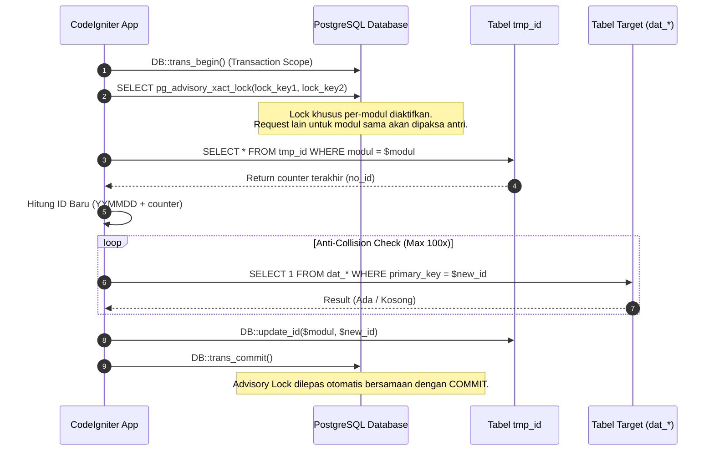

# Kaidah & Standar Pembuatan Database RSUD Soedomo SIMRS

Dokumen ini berisi aturan teknis, standar penamaan (*naming convention*), struktur skema SQL, dan kaidah pengelolaan database PostgreSQL pada sistem SIMRS RSUD Soedomo.

---

## 1. Spesifikasi Environment Database

- **Database Engine**: PostgreSQL 12+ (Driver CodeIgniter: `postgre`).
- **Database Utama**: `tm_rsudsoedomo_simrs_*`.
- **Database Log**: `dblog` (Server log terpisah).
- **Charset & Collation**: `utf8` / `utf8_general_ci`.

---

## 2. Aturan Penamaan Tabel (*Table Naming Conventions*)

Seluruh tabel dalam database wajib menggunakan huruf kecil (*lowercase*) dengan separator garis bawah (*underscore*) dan memiliki prefix yang jelas sesuai peruntukannya:

| Prefix | Kategori Tabel | Deskripsi | Contoh Tabel |
| :--- | :--- | :--- | :--- |
| `dat_` | **Data Transaksi** | Tabel yang menyimpan transaksi pelayanan medis, keperawatan, penunjang, farmasi, dll. | `dat_tih`, `dat_reasesmen_nyeri`, `dat_cppt`, `dat_resep` |
| `mst_` | **Master Data** | Tabel data acuan/master (pasien, pegawai, lokasi, diagnosa, formulir ERM). | `mst_pasien`, `mst_pegawai`, `mst_lokasi`, `mst_erekam_medis` |
| `log_` | **Log & Audit** | Tabel pencatatan aktivitas sistem & penanda status formulir. | `log_erekam_medis`, `log_user_activity` |
| `tmp_` | **Temporary & Counter**| Tabel temporary data, sesi, atau counter penggeneratoran ID. | `tmp_id` |

---

## 3. Aturan Penamaan Kolom & Primary Key (*Column Naming*)

1. **Primary Key Name**:
   - Nama kolom Primary Key **WAJIB** dibentuk dari nama tabel tanpa prefix `dat_`/`mst_`/`log_` lalu ditambahkan suffix `_id`.
   - **Contoh**:
     - Tabel `dat_tih` $\rightarrow$ Primary Key: `tih_id`
     - Tabel `dat_reasesmen_nyeri` $\rightarrow$ Primary Key: `reasesmennyeri_id`
     - Tabel `mst_erekam_medis` $\rightarrow$ Primary Key: `erekammedis_id`
2. **Foreign Key Standardization**:
   - Kolom kunci asing yang merujuk ke tabel utama wajib konsisten:
     - `pelayanan_id` $\rightarrow$ Merujuk ke `dat_pelayanan.pelayanan_id`
     - `registrasi_id` $\rightarrow$ Merujuk ke `dat_registrasi.registrasi_id`
     - `pasien_id` $\rightarrow$ Merujuk ke `mst_pasien.pasien_id`
     - `lokasi_id` $\rightarrow$ Merujuk ke `mst_lokasi.lokasi_id`
     - `dokter_id` / `pegawai_id` $\rightarrow$ Merujuk ke `mst_pegawai.pegawai_id`

---

## 4. 8 Kolom Audit Log Metadata Mandatory

Setiap tabel transaksi (`dat_`) **WAJIB** menyertakan **8 kolom metadata audit log standar** berikut pada posisi paling bawah tabel. Kolom-kolom ini diproses secara otomatis oleh helper `DB::insert()`, `DB::update()`, dan `DB::soft_delete()` di [db_helper.php](file:///home/geri/ITM/SOEDOMO/simrs/application/helpers/db_helper.php).

| Nama Kolom | Tipe Data | Default Value | Deskripsi & Otomatisasi |
| :--- | :--- | :--- | :--- |
| `created_at` | `TIMESTAMP` | `CURRENT_TIMESTAMP` | Waktu dibuat. Diisi otomatis oleh `DB::insert()` via `_now()`. |
| `created_by` | `VARCHAR(100)` | `NULL` | Realname pembuat. Diisi otomatis oleh `DB::insert()` via `_ses_get('user_realname')`. |
| `updated_at` | `TIMESTAMP` | `NULL` | Waktu update terakhir. Diisi otomatis oleh `DB::update()` via `_now()`. |
| `updated_by` | `VARCHAR(100)` | `NULL` | Realname pengubah. Diisi otomatis oleh `DB::update()` via `_ses_get('user_realname')`. |
| `deleted_at` | `TIMESTAMP` | `NULL` | Waktu soft delete. Diisi otomatis oleh `DB::soft_delete()`. |
| `deleted_by` | `VARCHAR(100)` | `NULL` | Realname penghapus. Diisi otomatis oleh `DB::soft_delete()`. |
| `active_st` | `CHAR(1)` | `'1'` | Status aktif data (`'1'` = Aktif, `'0'` = Non-aktif). |
| `deleted_st` | `CHAR(1)` | `'0'` | Status hapus (`'0'` = Normal, `'1'` = Soft Deleted). |

---

## 5. SQL Blueprint Template Pembuatan Tabel Baru

Berikut adalah template resmi DDL SQL untuk membuat tabel transaksi baru di RSUD Soedomo:

```sql
CREATE TABLE dat_nama_fitur (
    -- 1. Primary Key
    namafitur_id VARCHAR(50) NOT NULL PRIMARY KEY,

    -- 2. Mandatory Foreign Keys Pelayanan RSUD Soedomo
    pelayanan_id VARCHAR(50) NOT NULL,
    registrasi_id VARCHAR(50) NOT NULL,
    pasien_id VARCHAR(50) NULL,
    lokasi_id VARCHAR(50) NULL,

    -- 3. Data Substantif Form Transaksi
    tgl_transaksi TIMESTAMP NULL,
    keluhan_utama TEXT NULL,
    skor_penilaian INT DEFAULT 0,
    kategori_penilaian VARCHAR(100) NULL,
    pilihan_checkbox TEXT NULL, -- Disimpan dengan format delimiter hash '#' (contoh: 'A#B#C')
    catatan_dokter TEXT NULL,
    dokter_id VARCHAR(50) NULL,

    -- 4. 8 Kolom Metadata Audit Log Mandatory
    created_at TIMESTAMP NULL DEFAULT CURRENT_TIMESTAMP,
    created_by VARCHAR(100) NULL,
    updated_at TIMESTAMP NULL,
    updated_by VARCHAR(100) NULL,
    deleted_at TIMESTAMP NULL,
    deleted_by VARCHAR(100) NULL,
    active_st CHAR(1) DEFAULT '1',
    deleted_st CHAR(1) DEFAULT '0'
);

-- 5. Indexing Wajib PostgreSQL untuk Performa Query Dynamic Modal & DataTables
CREATE INDEX idx_dat_nama_fitur_pelayanan ON dat_nama_fitur(pelayanan_id);
CREATE INDEX idx_dat_nama_fitur_registrasi ON dat_nama_fitur(registrasi_id);
CREATE INDEX idx_dat_nama_fitur_pasien ON dat_nama_fitur(pasien_id);
CREATE INDEX idx_dat_nama_fitur_status ON dat_nama_fitur(active_st, deleted_st);
```

---

## 6. Generator ID Unik & Concurrency Lock (`tmp_id` + PostgreSQL Advisory Lock)

Untuk menghindari **ID duplikat**, **race condition**, dan **deadlock** saat banyak user memasukkan data secara bersamaan di RSUD Soedomo, generator ID menggunakan fungsi `DB::get_id($modul)` dengan mekanisme **PostgreSQL Transaction-Level Advisory Lock**:



### Penjelasan Format ID:
1. **Type 1 (Default)**: `YYMMDD` + 6 digit counter urut (Contoh: `260814000001`). Reset per hari.
2. **Type 2**: 12 digit padded counter urut tanpa reset harian (Contoh: `000000000001`).
3. **Type 3**: `YYMMDD` + 4 digit counter urut (Contoh: `2608140001`). Reset per hari.

---

## 7. Keamanan Data & Enkripsi Kolom Database

Data sensitif pasien (seperti NIK, nomor HP, atau riwayat diagnosa tertentu) dapat dikonfigurasi untuk mengalami enkripsi otomatis di database.

1. **Konfigurasi Field Terenkripsi**:
   Didaftarkan di `application/config/config.php` pada item `$config['encrypted_db_fields']`.
2. **Prosedur Otomatis di Helper `DB`**:
   Saat `DB::insert()` atau `DB::update()` dipanggil, helper memeriksa apakah nama field termasuk dalam `encrypted_db_fields`. Jika ya:
   - Data dienkripsi dengan **AES-256 CTR** via `DB::encrypt_column($value)`.
   - Log status enkripsi disimpan/diperbarui di tabel `mst_encrypt_db`.
3. **Dekripsi Otomatis Saat Query**:
   Setiap pemanggilan `DB::all()`, `DB::get()`, `DB::query()`, dan `DB::raw()` akan secara otomatis melakukan dekripsi data sensitif kembali ke plain text sebelum dikirimkan ke layer aplikasi.

---

## 8. Kaidah Soft Delete & Trash Policy

1. **Prinsip Utama**: Penghapusan data di SIMRS RSUD Soedomo **TIDAK BOLEH** menggunakan `DELETE FROM` (Hard Delete) secara langsung pada data medis pasien.
2. **Penggunaan Soft Delete**:
   ```php
   DB::soft_delete('dat_tih', ['tih_id' => $tih_id]);
   ```
   *Hasil*: Data tetap tersimpan di database tetapi tidak muncul di Query `DB::all()` karena `active_st = '0'` dan `deleted_st = '1'`.
3. **Fungsi Trash Backup**:
   Untuk tabel-tabel vital seperti `mst_pasien`, `dat_resep`, `dat_cppt`, method `DB::trash()` akan menduplikasi row data ke database backup (`trash`) sebelum pengubahan/penghapusan data dilakukan.
