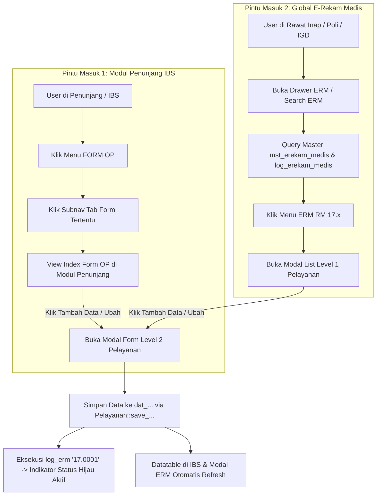

# Blueprint Standar E-Rekam Medis Khusus Form OP (IBS) RSUD Soedomo

Dokumen ini merupakan panduan arsitektur, standar teknis, dan SOP komprehensif untuk membangun atau merefactor modul **Formulir Operasi (FORM OP)** pada Instalasi Bedah Sentral (IBS) yang terintegrasi secara **Dual-Integration** sebagai bagian dari **E-Rekam Medis (ERM)** resmi SIMRS RSUD Soedomo.

---

> [!TIP]
> **GOLD STANDARD & BENCHMARK IMPLEMENTASI ERM FORM OP**:
> **REKAMAN ASUHAN KEPERAWATAN PERIOPERATIF (RM 17.1)** (`erekammedis_id: '17.0001'`).
> - **DDL & DML SQL**: `simrs/database/ddl_dat_askep_perioperatif.sql`
> - **Master ERM**: `mst_erekam_medis` (Grup `17`, Leaf `17.0001`, `berkas_no: 'RM 17.1'`, `lokasi_map: 'IBS#BANGSAL#IGD#ICU'`)
> - **Model**: [M_pelayanan.php](file:///c:/laragon/www/ITM/SOEDOMO/simrs/application/modules/pelayanan/models/M_pelayanan.php)
> - **Controller**: [Pelayanan.php](file:///c:/laragon/www/ITM/SOEDOMO/simrs/application/modules/pelayanan/controllers/Pelayanan.php)
> - **View List & JS (ERM)**: `simrs/application/modules/pelayanan/views/pelayanan/list_askep_perioperatif_modal.php` & `_js_list_askep_perioperatif_modal.php`
> - **View Form & JS (ERM)**: `simrs/application/modules/pelayanan/views/pelayanan/asesmen/form_askep_perioperatif_modal.php` & `_js_form_askep_perioperatif_modal.php`
> - **View Tab Penunjang IBS**: `simrs/application/modules/penunjang/views/penunjang/periksa/form_op/rekam_asuh_keperawatan_perioperatif/index_rekam_asuh_keperawatan_perioperatif.php`
> - **Cetak PDF Dompdf**: `simrs/application/modules/pelayanan/views/pelayanan/cetak/cetak_askep_perioperatif.php`

---

## 1. Konsep Arsitektur Dual-Integration Form OP

Modul Form OP memiliki karakteristik unik dibandingkan modul ERM rawat jalan atau rawat inap biasa karena harus dapat diakses melalui **dua pintu masuk utama**:



### Keuntungan Arsitektur Ini:
1. **Single Source of Truth**: Tabel basis data, validasi, logika simpan, dan berkas cetak PDF hanya dikelola di satu tempat (`pelayanan/models/M_pelayanan.php` & `pelayanan/controllers/Pelayanan.php`).
2. **Kesesuaian Standar Akreditasi Rekam Medis**: Setiap entri Form OP otomatis tercatat di `log_erekam_medis` sehingga indikator menu ERM berubah menjadi hijau jika dokumen sudah diisi.
3. **Fleksibilitas Akses**: Petugas kamar operasi dapat mengisi langsung saat operasi berlangsung di IBS, sedangkan dokter/perawat ruangan dapat melihat dan mencetak dokumen melalui menu ERM rawat inap.

---

## 2. Standar Desain UI & Aturan Tombol (Button Styling)

> [!IMPORTANT]
> **ATURAN MANDATORI UKURAN TOMBOL (NO `btn-sm` UNTUK TAMBAH DATA)**:
> - **Tombol Tambah Data Utama**: **WAJIB** menggunakan `class="btn btn-primary"`. **DILARANG KERAS** menggunakan `btn-sm` pada tombol tambah utama di header halaman / index view maupun modal list!
> - **Aksi Baris Tabel (DataTables)**: Boleh menggunakan `btn-sm` (misalnya `btn-outline-primary btn-sm` untuk dropdown aksi atau `btn-sm btn-outline-secondary` untuk cetak) demi kerapian tampilan baris tabel.

Contoh markup tombol tambah data yang benar:
```html
<a href="javascript:void(0)" onclick="_modal(event, {uri: '<?= site_url('pelayanan/pelayanan/form_askep_perioperatif_modal/' . @$pelayanan_id . '/' . @$registrasi_id) ?>', size: 'modal-full-width', position: 'normal', title: 'Tambah Asuhan Keperawatan Perioperatif (RM 17.1)'}, 2)" class="btn btn-primary">
    <i class="fas fa-plus-circle me-1"></i> Tambah Data
</a>
```

---

## 3. Tahapan Step-by-Step Pembuatan ERM Form OP Baru

### Tahap 1: Penyusunan SQL DDL & DML Registrasi

1. Buat file SQL di folder `simrs/database/ddl_dat_[nama_layanan].sql`.
2. Struktur Tabel Transaksi wajib memiliki **8 kolom audit log** dan relasi standar:
   - Primary Key: `[nama_layanan]_id varchar(12) NOT NULL`
   - Foreign Keys: `pelayanan_id`, `registrasi_id`, `pasien_id`, `lokasi_id`
   - Kolom Audit: `created_at`, `created_by`, `updated_at`, `updated_by`, `deleted_at`, `deleted_by`, `deleted_st int2 DEFAULT 0`, `active_st int2 DEFAULT 1`, `external_id varchar(128)`
   - Kolom Data Kompleks / Checkbox: Simpan sebagai `text` (JSON format).

Contoh DDL & DML:
```sql
-- DDL Tabel
CREATE TABLE IF NOT EXISTS public.dat_askep_perioperatif (
    askepperioperatif_id varchar(12) NOT NULL,
    pelayanan_id varchar(12) NOT NULL,
    registrasi_id varchar(12) NOT NULL,
    pasien_id varchar(12) NOT NULL,
    lokasi_id varchar(12) NULL,
    askepperioperatif_tgl timestamp(6) NULL,
    -- Field spesifik formulir...
    created_at timestamp(0) NULL,
    created_by varchar(128) NULL,
    updated_at timestamp(0) NULL,
    updated_by varchar(128) NULL,
    deleted_at timestamp(0) NULL,
    deleted_by varchar(128) NULL,
    deleted_st int2 DEFAULT 0 NOT NULL,
    active_st int2 DEFAULT 1 NOT NULL,
    external_id varchar(128) NULL,
    CONSTRAINT dat_askep_perioperatif_pkey PRIMARY KEY (askepperioperatif_id)
);

-- DML Registrasi Master ERM
INSERT INTO public.mst_erekam_medis (
    created_at, created_by, updated_at, updated_by, deleted_st, active_st,
    erekammedis_id, parent_id, erekammedis_nm, erekammedis_tp,
    icon, uri_controller, function_controller, size_modal, type_modal, lokasi_map, berkas_no
) VALUES (
    NOW(), 'IT SIMRS', NOW(), 'IT SIMRS', 0, 1,
    '17.0001', '17', 'Asuhan Keperawatan Perioperatif', 'D',
    'fas fa-file-medical-alt', 'uri', 'list_askep_perioperatif_modal/pelayanan_id/registrasi_id',
    'modal-full-width', 'modal', 'IBS#BANGSAL#IGD#ICU', 'RM 17.1'
) ON CONFLICT (erekammedis_id) DO NOTHING;
```

---

### Tahap 2: Implementasi Model (`M_pelayanan.php`)

Tambahkan 3 fungsi inti pada `application/modules/pelayanan/models/M_pelayanan.php`:

```php
  /*
  ASUHAN KEPERAWATAN PERIOPERATIF (RM 17.1)
  */

  public function load_datatables_[nama_layanan]()
  {
    $query = "SELECT * FROM 
              (
                SELECT 
                  a.*, 
                  b.pegawai_nm AS dokter_nm,
                  p1.pegawai_nm AS perawat_ruangan_nm,
                  p2.pegawai_nm AS perawat_ok_b_nm
                FROM dat_[nama_layanan] a
                LEFT JOIN mst_pegawai b ON a.dokter_id = b.pegawai_id
                LEFT JOIN mst_pegawai p1 ON a.perawat_ruangan_id = p1.pegawai_id
                LEFT JOIN mst_pegawai p2 ON a.perawat_ok_b_id = p2.pegawai_id
                WHERE 
                  a.registrasi_id = '" . @$this->input->post('registrasi_id') . "' 
                  AND (a.deleted_st = '0' OR a.deleted_st IS NULL)
                ORDER BY a.[nama_layanan]_id DESC
              ) a";
    $search = null;
    $where = null;
    $is_where = null;
    DB::datatables_query($query, $search, $where, $is_where);
  }

  public function get_[nama_layanan]($id = null, $type_where = null)
  {
    $sql = "SELECT 
              a.*, 
              b.pegawai_nm AS dokter_nm, b.ttd AS dokter_ttd, b.sip_no AS dokter_sip_no,
              p1.pegawai_nm AS perawat_ruangan_nm, p1.ttd AS perawat_ruangan_ttd, p1.sip_no AS perawat_ruangan_sip_no,
              p2.pegawai_nm AS perawat_ok_b_nm, p2.ttd AS perawat_ok_b_ttd, p2.sip_no AS perawat_ok_b_sip_no
            FROM dat_[nama_layanan] a 
            LEFT JOIN mst_pegawai b ON a.dokter_id = b.pegawai_id
            LEFT JOIN mst_pegawai p1 ON a.perawat_ruangan_id = p1.pegawai_id
            LEFT JOIN mst_pegawai p2 ON a.perawat_ok_b_id = p2.pegawai_id
            WHERE a.$type_where = ? AND (a.deleted_st = '0' OR a.deleted_st IS NULL)";
    return DB::raw('row_array', $sql, $id);
  }

  public function save_[nama_layanan]($registrasi_id = null)
  {
    $d = _post();
    $erekammedis_id = !empty($d['erekammedis_id']) ? $d['erekammedis_id'] : '17.0001';
    unset($d['erekammedis_id']);
    $current_user = _ses_get('user_realname');

    // Format Tanggal & Waktu
    if (!empty($d['[nama_layanan]_tgl'])) {
      $d['[nama_layanan]_tgl'] = to_date($d['[nama_layanan]_tgl'], '-', 'full_date');
    }

    // Encoding Array / Checkbox JSON Fields
    $json_fields = ['riwayat_penyakit', 'posisi_operasi', 'ceklist_verifikasi'];
    foreach ($json_fields as $jf) {
      if (isset($d[$jf])) {
        $d[$jf] = is_array($d[$jf]) ? json_encode($d[$jf]) : $d[$jf];
      }
    }

    // Sanitasi Textarea
    $textarea_fields = ['catatan', 'rencana_tindakan'];
    foreach ($textarea_fields as $field) {
      if (isset($d[$field])) {
        $d[$field] = htmlspecialchars(@$this->input->post($field, true), ENT_QUOTES);
      }
    }

    // Eksekusi Insert / Update
    if (!empty($d['[nama_layanan]_id'])) {
      $d['updated_at'] = date('Y-m-d H:i:s');
      $d['updated_by'] = $current_user;
      $res = DB::update('dat_[nama_layanan]', $d, ['[nama_layanan]_id' => $d['[nama_layanan]_id']]);
    } else {
      $d['[nama_layanan]_id'] = DB::get_id('dat_[nama_layanan]');
      $d['created_at'] = date('Y-m-d H:i:s');
      $d['created_by'] = $current_user;
      $d['deleted_st'] = 0;
      $d['active_st'] = 1;
      $res = DB::insert('dat_[nama_layanan]', $d);
      DB::update_id('dat_[nama_layanan]', $d['[nama_layanan]_id']);
    }

    // Update Log ERM untuk Indikator Status Hijau
    if ($res['status']) {
      log_erm($erekammedis_id, @$d['pelayanan_id'], @$d['registrasi_id'], @$d['lokasi_id'], '');
      return ['status' => true, 'res' => '01'];
    } else {
      return ['status' => false, 'res' => '11'];
    }
  }
```

---

### Tahap 3: Implementasi Controller (`Pelayanan.php`)

1. Daftarkan jenis tabel pada fungsi `ajax_datatables`:
   ```php
   if ($type == '[nama_layanan]') {
       $this->m_pelayanan->load_datatables_[nama_layanan]();
   }
   ```

2. Tambahkan endpoints berikut pada [Pelayanan.php](file:///c:/laragon/www/ITM/SOEDOMO/simrs/application/modules/pelayanan/controllers/Pelayanan.php):
   ```php
   public function list_[nama_layanan]_modal($pelayanan_id = null, $registrasi_id = null, $berkas_no = null)
   {
       $d['pelayanan_id']  = @$pelayanan_id;
       $d['registrasi_id'] = @$registrasi_id;
       $d['berkas_no']     = !empty($berkas_no) ? $berkas_no : _get('berkas_no');
       $this->render($this->template . 'list_[nama_layanan]_modal', $d);
   }

   public function form_[nama_layanan]_modal($pelayanan_id = null, $registrasi_id = null, $[nama_layanan]_id = null, $berkas_no = null)
   {
       $d['pelayanan_id']  = @$pelayanan_id;
       $d['registrasi_id'] = @$registrasi_id;
       $d['berkas_no']     = !empty($berkas_no) ? $berkas_no : _get('berkas_no');
       $d['pelayanan']     = $this->m_pelayanan->get_pelayanan($pelayanan_id);
       $d['pasien']        = $this->m_pelayanan->get_detail_pasien(@$d['pelayanan']['pasien_id']);
       $d['main']          = $this->m_pelayanan->get_[nama_layanan]($[nama_layanan]_id, '[nama_layanan]_id');
       
       // Auto-populate diagnosa dokter dari dat_anamnesis (JSON icd10_dokter)
       if (empty($d['main']['diagnosa_sebelum_operasi'])) {
           $anamnesis = DB::raw('row_array', "SELECT icd10_dokter FROM dat_anamnesis WHERE registrasi_id = ? AND deleted_st = '0' ORDER BY anamnesis_id DESC LIMIT 1", [$registrasi_id]);
           if (!empty($anamnesis['icd10_dokter'])) {
               $icd = json_decode($anamnesis['icd10_dokter'], true);
               if (!empty($icd) && is_array($icd)) {
                   $d['main']['diagnosa_sebelum_operasi'] = !empty($icd[0]['icd10_nm']) ? $icd[0]['icd10_nm'] : (@$icd[0]['icd_nm'] ?: @$icd[0]['nama']);
               }
           }
       }

       $d['all_pegawai']   = DB::raw('result_array', "SELECT a.pegawai_id, a.pegawai_nm FROM mst_pegawai a WHERE a.active_st = '1' AND a.deleted_st = '0' ORDER BY a.pegawai_nm ASC");
       $d['form_act']      = site_url($this->template) . 'save_[nama_layanan]/' . $registrasi_id . '?n=' . _get('n');
       $this->render($this->template . 'asesmen/form_[nama_layanan]_modal', $d);
   }

   public function save_[nama_layanan]($registrasi_id = null)
   {
       $res = $this->m_pelayanan->save_[nama_layanan]($registrasi_id);
       _json(_response($res['res'], $this->uri_pelayanan . '/form/' . @$this->input->post('pelayanan_id')));
   }

   public function delete_[nama_layanan]($[nama_layanan]_id = null)
   {
       $current_user = _ses_get('user_realname');
       DB::update('dat_[nama_layanan]', [
           'deleted_st' => 1,
           'deleted_at' => date('Y-m-d H:i:s'),
           'deleted_by' => $current_user
       ], ['[nama_layanan]_id' => @$[nama_layanan]_id]);
       _json(_response('03', ''));
   }

   public function cetak_[nama_layanan]($pelayanan_id = null, $[nama_layanan]_id = null, $berkas_no = null)
   {
       ini_set("memory_limit", "-1");
       $this->load->library('PdfDom');
       $file_pdf = 'cetak_[nama_layanan]';
       $paper = 'a4'; // atau 'folio'
       $orientation = "portrait";

       $data['identitas'] = $this->m_app->identitas_get();
       $data['pelayanan'] = $this->m_pelayanan->get_pelayanan($pelayanan_id);
       $data['pasien']    = $this->m_pelayanan->get_detail_pasien(@$data['pelayanan']['pasien_id']);
       $data['main']      = $this->m_pelayanan->get_[nama_layanan]($[nama_layanan]_id, '[nama_layanan]_id');
       $data['berkas_no'] = !empty($berkas_no) ? $berkas_no : _get('berkas_no');

       $html = $this->load->view($this->template . 'cetak/cetak_[nama_layanan]', $data, true);
       $this->pdfdom->generate($html, $file_pdf, $paper, $orientation);
   }
   ```

---

### Tahap 4: Integrasi Tampilan Tab di Modul IBS (`Penunjang`)

Di folder `simrs/application/modules/penunjang/views/penunjang/periksa/form_op/[nama_fitur]/`:

Buat berkas `index_[nama_fitur].php` yang memuat DataTable server-side yang terhubung ke endpoint pelayanan:

```php
<div class="row">
    <!-- Subnav Sidebar -->
    <div class="col-lg-2 border-end">
        <?php _view($tpl_subnav) ?>
    </div>

    <!-- Main Content Area -->
    <div class="col-lg-10">
        <div class="page-wrapper">
            <div class="page-header d-print-none mt-2 mb-2">
                <div class="container-fluid p-0">
                    <div class="d-flex align-items-center justify-content-between">
                        <div>
                            <h3 class="page-title text-primary mb-0">
                                <i class="fas fa-file-medical-alt me-2"></i>[JUDUL FORM OP / RM NO]
                            </h3>
                            <small class="text-muted">Dokumen Asuhan Keperawatan Perioperatif Kamar Operasi / IBS</small>
                        </div>
                        <div>
                            <!-- PENTING: Gunakan btn btn-primary (TIDAK BOLEH btn-sm) -->
                            <a href="javascript:void(0)" onclick="_modal(event, {uri: '<?= site_url('pelayanan/pelayanan/form_[nama_layanan]_modal/' . @$pelayanan_id . '/' . @$registrasi_id) ?>', size: 'modal-full-width', position: 'normal', title: 'Tambah Data'}, 2)" class="btn btn-primary">
                                <i class="fas fa-plus-circle me-1"></i> Tambah Data
                            </a>
                        </div>
                    </div>
                </div>
            </div>

            <div class="card shadow-sm border-0 mt-2">
                <div class="card-body p-2">
                    <div class="table-responsive">
                        <table class="table table-vcenter card-table table-striped table-sm display nowrap" id="datatable_[nama_layanan]_ibs" style="width: 100%;">
                            <thead>
                                <tr>
                                    <th width="5%">No</th>
                                    <th width="8%">Aksi</th>
                                    <th width="12%">Tgl. Catat</th>
                                    <th width="25%">Diagnosa</th>
                                    <th width="25%">Tindakan / Operasi</th>
                                    <th width="15%">Petugas</th>
                                    <th width="10%">Cetak</th>
                                </tr>
                            </thead>
                            <tbody></tbody>
                        </table>
                    </div>
                </div>
            </div>
        </div>
    </div>
</div>
```

---

### Tahap 5: Standar Cetak PDF Dompdf (Kop Surat 3-Kolom & DejaVu Sans Checkmarks)

Untuk file cetak di `application/modules/pelayanan/views/pelayanan/cetak/cetak_[nama_layanan].php`:

1. **Font DejaVu Sans**: Wajib digunakan untuk memastikan simbol unicode checkmark (`&#10003;` dan `&#9633;`) ter-render sempurna tanpa tanda tanya (`?`).
   ```css
   body, table, td, th, span, div, p {
       font-family: 'DejaVu Sans', 'Helvetica Neue', Arial, sans-serif !important;
   }
   ```
2. **Kop Surat 3-Kolom Simetris (`height: 105px;`)**:
   - Kolom Kiri: Logo Pemkab (`lap_logo_berwarna`)
   - Kolom Tengah: Identitas RSUD Soedomo & Alamat
   - Kolom Kanan: Kotak Nomor Berkas RM (misal `RM 17.1`)
3. **Pemeriksaan Logo**: Gunakan `!empty($identitas['lap_logo_berwarna'])`, jangan gunakan `file_exists()`.
4. **TTE QR Code**: Gunakan helper `generate_ttd()` atau `generate_qr_code_base64()`.

---

## 4. Checklist Verifikasi Akhir Pembuatan Form OP

Sebelum merilis modul Form OP, pastikan seluruh item berikut telah diverifikasi:

- [ ] Tabel transaksi di PostgreSQL sudah dibuat dan memiliki 8 kolom audit log wajib.
- [ ] Formulir terdaftar di `public.mst_erekam_medis` dengan `parent_id = '17'`.
- [ ] Tombol Tambah Data di View Index IBS menggunakan `class="btn btn-primary"` (bukan `btn-sm`).
- [ ] Modul dapat dibuka dari menu **FORM OP di IBS** dan dari **Drawer Menu ERM**.
- [ ] Pengisian data berhasil disimpan dan memicu `log_erm()` (indikator menu ERM berubah hijau).
- [ ] Cetak PDF Dompdf ter-render rapi dengan kop surat 3-kolom simetris dan unicode checkmark tampil sempurna.
- [ ] Menjalankan linter `php -l` pada seluruh file model, controller, dan view dengan 0 error.
