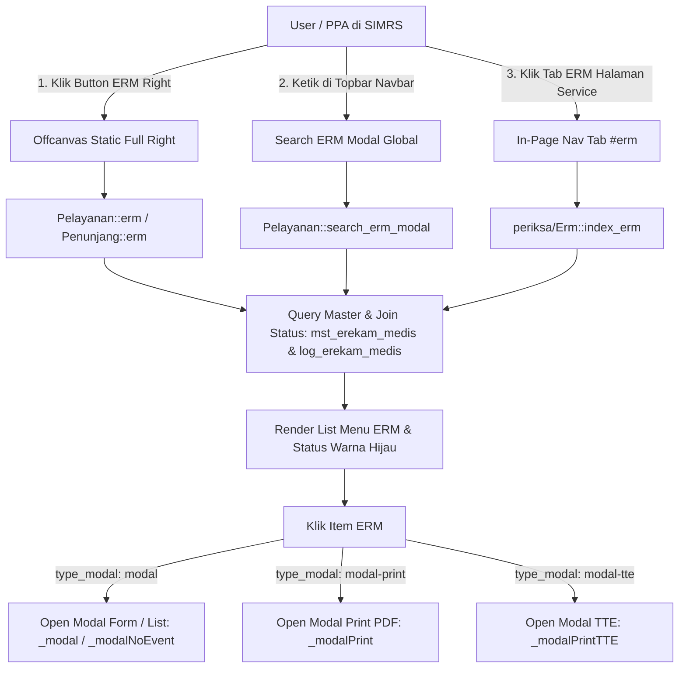

# Knowledge Base & Blueprint Standar E-Rekam Medis (ERM) RSUD Soedomo

Dokumen ini merupakan **panduan teknis komprehensif, arsitektur, dan SOP end-to-end** untuk membuat, mengonfigurasi, dan mendaftarkan formulir **E-Rekam Medis (ERM)** baru pada sistem SIMRS RSUD Soedomo.

---

## 1. Arsitektur & 3 Jalur Akses ERM (*Access Entrypoints*)

Sistem SIMRS RSUD Soedomo menyediakan **tiga jalur utama** bagi PPA (Dokter, Perawat, Bidan, Petugas Medis) untuk mengakses modul E-Rekam Medis:



### 1.1 Offcanvas Static Full Right (Menu Drawer ERM)
- **Lokasi Trigger**: Button ERM di [form.php:L798](file:///home/geri/ITM/SOEDOMO/simrs/application/modules/pelayanan/views/pelayanan/form.php#L798).
- **JS Code**:
  ```javascript
  _offcanvas_static_full_right(event, {
      uri: '<?= $this->uri . "/erm/" . @$main["pelayanan_id"] . "?n=" . _get("n") ?>',
      title: 'E-REKAM MEDIS',
      header: 'boxOffCanvasStaticFullRightHeader',
      body: 'boxOffCanvasStaticFullRightBody'
  });
  ```

### 1.2 Global Search ERM via Navbar Topbar
- **Lokasi Trigger**: Input pencarian navbar di [navbar.php:L13](file:///home/geri/ITM/SOEDOMO/simrs/application/modules/app/views/template/navbar.php#L13).
- **JS Code**:
  ```javascript
  _modal(event, {
      uri: '<?= $this->uri . "/search_erm_modal" ?>',
      size: 'modal-md',
      position: 'normal',
      title: 'Cari ERM'
  });
  ```
- **Controller Entrypoint**: `Pelayanan::search_erm_modal($pelayanan_id, $registrasi_id)`. Menguji autocomplete AJAX dari `mst_erekam_medis`.

### 1.3 Nav Tab Mode (In-Page Navigation ERM)
- **Lokasi Trigger**: Tab header pada formulir pelayanan utama:
  - [form.php:L1445](file:///home/geri/ITM/SOEDOMO/simrs/application/modules/pelayanan/views/pelayanan/form.php#L1445)
  - [form_dokter.php:L1383](file:///home/geri/ITM/SOEDOMO/simrs/application/modules/pelayanan/views/pelayanan/form_dokter.php#L1383)
- **HTML / JS Trigger**:
  ```html
  <li class="nav-item" id="erm">
    <a href="javascript:void(0)" onclick="_tab('erm', {pelayanan_id : '<?= @$main['pelayanan_id'] ?>', registrasi_id : '<?= @$main['registrasi_id'] ?>'})" id="nav_erm" class="nav-link" data-bs-toggle="tab">
      <i class="fas fa-copy me-2"></i> ELEKTRONIK REKAM MEDIS ( ERM )
    </a>
  </li>
  ```
- **Controller Delegation**:
  Memanggil method `Pelayanan::erm()` yang mendelegasikan pemanggilan ke sub-controller `periksa/Erm::index_erm($pelayanan_id, $registrasi_id)`. Hasilnya di-load secara AJAX langsung ke dalam kontainer `#tabs-body`.

---

## 2. Struktur Master ERM (`mst_erekam_medis`) & Pendaftaran Form Baru

Setiap formulir ERM **wajib terdaftar** di dalam tabel `mst_erekam_medis`.

### 2.1 Skema Tabel `mst_erekam_medis`

| Field | Tipe Data | Deskripsi & Aturan RSUD Soedomo |
| :--- | :--- | :--- |
| `erekammedis_id` | `VARCHAR(20)` | **Primary Key**. Kode hierarkis bertitik (Contoh: `01` = Group Header, `01.0001` = Form Detail). |
| `erekammedis_nm` | `VARCHAR(200)`| Nama resmi formulir (Contoh: "Transfer Intra Hospital", "Asesmen Keperawatan Rawat Inap"). |
| `parent_id` | `VARCHAR(20)` | FK ke `erekammedis_id` milik Group Header (Diisi jika `erekammedis_tp = 'D'`). |
| `erekammedis_tp` | `CHAR(1)` | `'G'` = Group Header, `'D'` = Detail Form Leaf. |
| `uri_controller` | `VARCHAR(100)`| Prefix base URI: `'uri'` (`pelayanan/`), `'uri_penunjang'` (`penunjang/`), dll. |
| `function_controller`| `VARCHAR(255)`| Path method & parameter URL, contoh: `list_tih_modal/pelayanan_id/registrasi_id`. |
| `type_modal` | `VARCHAR(20)` | Tipe peluncur: `'modal'` (Form Input), `'modal-print'` (PDF Preview), `'modal-tte'` (Digital Signature). |
| `size_modal` | `VARCHAR(20)` | Ukuran Bootstrap modal: `'modal-sm'`, `'modal-md'`, `'modal-lg'`, `'modal-xl'`, `'modal-full-width'`. |
| `icon` | `VARCHAR(50)` | Icon FontAwesome / Tabler (Contoh: `fas fa-file-medical`, `fas fa-shield-alt`). |
| `lokasi_map` | `VARCHAR(255)`| Pemetaan unit lokasi dengan delimiter `#` (Contoh: `POLI#IGD#BANGSAL`). |
| `active_st` | `CHAR(1)` | Status aktif (`'1'` = Aktif, `'0'` = Non-aktif). |
| `deleted_st` | `CHAR(1)` | Soft delete status (`'0'` = Normal, `'1'` = Deleted). |

### 2.2 Template SQL Insert Pendaftaran Fitur ERM Baru

```sql
-- 1. Tambah Group Header (Jika Kategori Belum Ada)
INSERT INTO mst_erekam_medis (erekammedis_id, erekammedis_nm, parent_id, erekammedis_tp, active_st, deleted_st)
VALUES ('06', 'ASESMEN KHUSUS RSUD SOEDOMO', NULL, 'G', '1', '0');

-- 2. Tambah Detail Form ERM Baru
INSERT INTO mst_erekam_medis (
    erekammedis_id, erekammedis_nm, parent_id, erekammedis_tp,
    uri_controller, function_controller, type_modal, size_modal,
    icon, lokasi_map, active_st, deleted_st
) VALUES (
    '06.0001', 'Form Monitoring Pembatasan Gerak (Fisik)', '06', 'D',
    'uri', 'list_monitoring_pembatasan_gerak_modal/pelayanan_id/registrasi_id', 'modal', 'modal-xl',
    'fas fa-user-lock', 'POLI#IGD#BANGSAL', '1', '0'
);
```

---

## 3. Log Status Pengisian ERM (`log_erekam_medis` & `log_erm()`)

Agar menu item ERM menampilkan **warna hijau tebal** (`fw-bold text-success`) pada daftar menu setelah formulir disimpan, sistem memanfaatkan fungsi `log_erm()` di [itm_helper.php](file:///home/geri/ITM/SOEDOMO/simrs/application/helpers/itm_helper.php).

### 3.1 Skema Tabel `log_erekam_medis`
- `log_erm_id` (PK, ID dari `DB::get_id('log_erekam_medis')`)
- `pelayanan_id`
- `registrasi_id`
- `pasien_id`
- `lokasi_id`
- `erekammedis_id`
- `log_erm_tgl` (TIMESTAMP)

### 3.2 Pemanggilan Mandatory pada Model Save Procedure
```php
// Panggil log_erm setiap kali transaksi simpan ERM BERHASIL
if ($res['status']) {
    log_erm($erekammedis_id, $d['pelayanan_id'], $registrasi_id, @$d['lokasi_id'], @$d['pasien_id']);
    return ['res' => '01'];
}
```

### 3.3 Query Filter PostgreSQL di `M_erm.php`
Model `M_erm.php` mengeksekusi pencocokan lokasi unit kerja menggunakan klausa regex PostgreSQL `SIMILAR TO`:
```sql
SELECT a.*, b.log_erm_id
FROM mst_erekam_medis a
LEFT JOIN log_erekam_medis b ON b.registrasi_id = '$registrasi_id' AND a.erekammedis_id = b.erekammedis_id
WHERE a.erekammedis_tp = 'D'
  AND a.lokasi_map SIMILAR TO '%(POLI|IGD|BANGSAL)%'
  AND a.parent_id = '$group_id'
  AND a.deleted_st = 0 AND a.active_st = 1
ORDER BY a.erekammedis_id ASC;
```

---

## 4. Full Code Complete Blueprint Template

Berikut adalah contoh lengkap pembuatan modul ERM berstandar RSUD Soedomo.

### 4.1 Controller Layer (`Pelayanan.php`)

```php
// 1. Entrypoint Level 1 Modal (List History Data)
public function list_monitoring_gerak_modal($pelayanan_id = null, $registrasi_id = null)
{
    $d['pelayanan_id'] = @$pelayanan_id;
    $d['registrasi_id'] = @$registrasi_id;
    $this->render($this->template . '/list_monitoring_gerak_modal', $d);
}

// 2. Entrypoint Level 2 Modal (Form Input Data)
public function form_monitoring_gerak_modal($pelayanan_id = null, $registrasi_id = null, $monitoringgerak_id = null)
{
    $d['pelayanan_id']  = @$pelayanan_id;
    $d['registrasi_id'] = @$registrasi_id;
    $d['pelayanan']     = $this->m_pelayanan->get_pelayanan($pelayanan_id);
    $d['main']          = $this->m_pelayanan->get_monitoring_gerak($monitoringgerak_id);
    $d['form_act']      = site_url($this->template) . 'save_monitoring_gerak/' . $registrasi_id . '?n=' . _get('n');

    $this->render($this->template . 'asesmen/form_monitoring_gerak_modal', $d);
}

// 3. Save Handler
public function save_monitoring_gerak($registrasi_id = null)
{
    $res = $this->m_pelayanan->save_monitoring_gerak($registrasi_id);
    _json(_response($res['res'], $this->uri_pelayanan . '/form/' . @$this->input->post('pelayanan_id')));
}

// 4. Delete Handler (Soft Delete)
public function delete_monitoring_gerak($monitoringgerak_id = null)
{
    DB::soft_delete('dat_monitoring_gerak', ['monitoringgerak_id' => @$monitoringgerak_id]);
    _json(_response('03', ''));
}

// 5. Cetak PDF Handler
public function cetak_monitoring_gerak($pelayanan_id = null, $monitoringgerak_id = null)
{
    ini_set("memory_limit", "-1");
    $file_pdf    = 'cetak_monitoring_gerak_' . $pelayanan_id;
    $paper       = 'A4';
    $orientation = 'portrait';

    $data['identitas'] = $this->m_app->identitas_get();
    $data['pelayanan'] = $this->m_pelayanan->get_pelayanan($pelayanan_id);
    $data['pasien']    = $this->m_pelayanan->get_detail_pasien(@$data['pelayanan']['pasien_id']);
    $data['main']      = $this->m_pelayanan->get_monitoring_gerak($monitoringgerak_id);

    $html = $this->load->view($this->template . 'cetak/cetak_monitoring_gerak', $data, true);
    $this->load->library('PdfDom');
    $this->pdfdom->generate($html, $file_pdf, $paper, $orientation);
}
```

### 4.2 Model Layer (`M_pelayanan.php`)

```php
// DataTables Server-Side Load
public function load_datatables_monitoring_gerak()
{
    $query = "SELECT * FROM (
        SELECT 
            a.*,
            b.pegawai_nm AS dokter_nm
        FROM dat_monitoring_gerak a
        LEFT JOIN mst_pegawai b ON a.dokter_id = b.pegawai_id
        WHERE a.registrasi_id = '" . @$this->input->post('registrasi_id') . "'
          AND a.deleted_st = '0'
        ORDER BY a.monitoringgerak_id DESC
    ) a";

    $search   = ['a.monitoringgerak_id', 'b.pegawai_nm'];
    $where    = null;
    $is_where = null;
    DB::datatables_query($query, $search, $where, $is_where);
}

// Save Procedure
public function save_monitoring_gerak($registrasi_id = null)
{
    $d = _post();
    $erekammedis_id = @$d['erekammedis_id'];
    unset($d['erekammedis_id']);

    if (empty($d['monitoringgerak_id'])) {
        // Insert Baru
        $d['monitoringgerak_id'] = DB::get_id('dat_monitoring_gerak');
        $res = DB::insert('dat_monitoring_gerak', $d);
        DB::update_id('dat_monitoring_gerak', $d['monitoringgerak_id']);

        if ($res['status']) {
            log_erm($erekammedis_id, $d['pelayanan_id'], $registrasi_id, @$d['lokasi_id'], @$d['pasien_id']);
            return ['res' => '01'];
        }
        return ['res' => '11'];
    } else {
        // Update Eksisting
        $res = DB::update('dat_monitoring_gerak', $d, ['monitoringgerak_id' => $d['monitoringgerak_id']]);
        if ($res['status']) {
            log_erm($erekammedis_id, $d['pelayanan_id'], $registrasi_id, @$d['lokasi_id'], @$d['pasien_id']);
            return ['res' => '02'];
        }
        return ['res' => '12'];
    }
}
```
