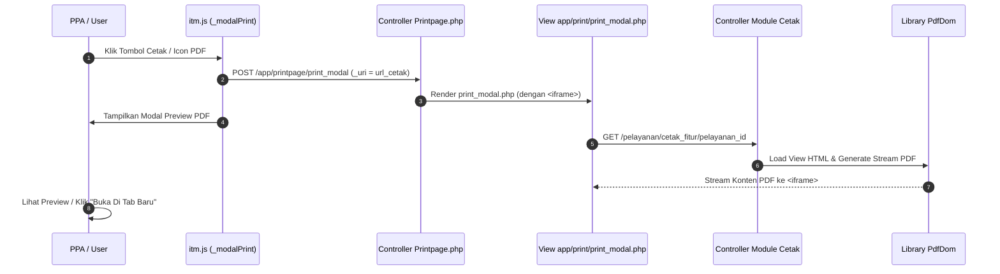

# Kaidah & Standar Pembuatan List Cetak & PDF SIMRS RSUD Soedomo

Dokumen ini menjelaskan standar arsitektur pencetakan dokumen medis, pratinjau (*preview*) PDF berbasis modal, Tanda Tangan Elektronik (TTE), dan pembuatan template cetak PDF di SIMRS RSUD Soedomo.

---

## 1. Arsitektur Pratinjau Modal Cetak (*Modal Print Engine*)

Di SIMRS RSUD Soedomo, pencetakan dokumen ERM/pelayanan **TIDAK LANGSUNG** mengunduh file atau membuka tab baru secara paksa. Sistem menggunakan jembatan modal preview (`Printpage::print_modal`) berbasis `<iframe>` di dalam Bootstrap Modal.



---

## 2. Peluncur JavaScript Modal Cetak

### 2.1 `_modalPrint(event, arg, idx = 1)`
Digunakan untuk membuka preview dokumen cetak standar (Non-TTE).

```html
<!-- Contoh Tombol Cetak di DataTables / Modal Level 1 -->
<a href="javascript:void(0)"
   onclick="_modalPrint(event, {uri: '<?= site_url($this->template . 'cetak_tih/' . $pelayanan_id . '/' . $tih_id) ?>', size: 'modal-xl', title: 'CETAK TRANSFER INTRA HOSPITAL'}, 2)"
   class="btn btn-info btn-xs">
  <i class="fas fa-print me-1"></i> Cetak
</a>
```

### 2.2 `_modalPrintTTE(event, arg, idx = 1)`
Digunakan untuk membuka preview dokumen cetak yang mendukung verifikasi dan Tanda Tangan Elektronik (TTE).

```html
<a href="javascript:void(0)"
   onclick="_modalPrintTTE(event, {uri: '<?= site_url($this->template . 'cetak_tih_tte/' . $pelayanan_id . '/' . $tih_id) ?>', size: 'modal-xl', title: 'CETAK & VERIFIKASI TTE'}, 2)"
   class="btn btn-warning btn-xs">
  <i class="fas fa-file-signature me-1"></i> Cetak TTE
</a>
```

---

## 3. Komponen Bridge & Template View Preview (`print_modal.php`)

Controller [Printpage.php](file:///home/geri/ITM/SOEDOMO/simrs/application/modules/app/controllers/Printpage.php) menerima URL `_uri` dari AJAX POST dan merender view `app/print/print_modal.php`:

```html
<!-- Konten Views app/print/print_modal.php -->
<style>
  #frame_pdf {
    width: 100%;
    min-height: 80vh;
  }
</style>

<div class="card-body">
  <div class="row">
    <div class="col-md-12">
      <iframe id="frame_pdf" src="<?= $uri ?>" frameborder="0"></iframe>
    </div>
  </div>
  <div class="border-dotted"></div>
  <div class="mt-2 text-center">
    <button type="button" class="btn btn-secondary" data-bs-dismiss="modal">
      <?= _icon('cancel') ?> Tutup
    </button>
    <a href="<?= $uri ?>" target="_blank" class="btn btn-primary">
      Buka Di Tab Baru <i class="fas fa-external-link-alt ms-1"></i>
    </a>
  </div>
</div>
```

---

## 4. Kaidah Penulisan Controller Cetak (`Pelayanan.php`)

Setiap method pencetakan pada controller wajib mengikuti 5 aturan berikut:

1. **ALOKASI MEMORI WAJIB**: Sertakan `ini_set("memory_limit", "-1");` di awal method untuk mencegah error *fatal out of memory* saat me-render HTML/gambar berukuran besar.
2. **NAMA FILE PDF STRUKTUR**: Tentukan `$file_pdf = 'cetak_' . $nama_fitur . '_' . $pelayanan_id`.
3. **PENGAMBILAN IDENTITAS RS**: Wajib mengambil identitas resmi RSUD Soedomo via `$data['identitas'] = $this->m_app->identitas_get();` untuk Kop Surat.
4. **SETTING KERTAS & ORIENTASI**: Definisikan `$paper = 'A4'` (atau `'F4'`) dan `$orientation = 'portrait'` (atau `'landscape'`).
5. **DOMPDF GENERATE**: Panggil `$this->pdfdom->generate($html, $file_pdf, $paper, $orientation)`.

```php
public function cetak_tih($pelayanan_id = null, $tih_id = null)
{
    // 1. Alokasi Memori Murni
    ini_set("memory_limit", "-1");

    // 2. Metadata File & Kertas
    $file_pdf    = 'cetak_tih_' . $pelayanan_id;
    $paper       = 'A4';
    $orientation = 'portrait';

    // 3. Query Data Substantif
    $data['identitas'] = $this->m_app->identitas_get();
    $data['pelayanan'] = $this->m_pelayanan->get_pelayanan($pelayanan_id);
    $data['pasien']    = $this->m_pelayanan->get_detail_pasien(@$data['pelayanan']['pasien_id']);
    $data['main']      = $this->m_pelayanan->get_tih($tih_id);

    // 4. Render HTML View ke String
    $html = $this->load->view($this->template . 'cetak/cetak_tih', $data, true);

    // 5. Generate PDF Stream
    $this->load->library('PdfDom');
    $this->pdfdom->generate($html, $file_pdf, $paper, $orientation);
}
```

---

## 5. Kaidah Paten & Standar Template HTML View Cetak (`cetak_...php`)

Template cetak PDF di-render menggunakan library **Dompdf** (`PdfDom.php`). Untuk memastikan tampilan konsisten di seluruh lembar cetak ERM RSUD Soedomo dan terhindar dari bug rendering Dompdf, seluruh file view cetak **WAJIB** mematuhi Aturan Paten berikut:

---

### 5.1 Aturan Paten Base64 Logo & Kop Surat Standar SIMRS RSUD Soedomo

1. **DILARANG MENGGUNAKAN `base_url()` UNTUK GAMBAR LOGO**:
   Logo RS pada Kop Surat **WAJIB** menggunakan Base64 Data URI dari variabel database `$identitas['lap_logo']`:

   ```html
   " height="45px">
   ```

2. **STRUKTUR KOP SURAT 3 KOLOM OFFICIAL (DINAMIS DATABASE `mst_identitas`)**:
   - **Kolom 1 (Kiri - `36%`)**: Logo Base64 RSUD Soedomo di posisi atas (center), diikuti teks dinamis dari `$identitas` (`mst_identitas`):
     - Line 1: `strtoupper(@$identitas['lap_title_1'])` (Pemerintah Daerah)
     - Line 2: `strtoupper(@$identitas['lap_title_2'])` (Dinas Kesehatan)
     - Line 3: `strtoupper(@$identitas['rumahsakit_nm'])` (Nama Rumah Sakit)
     - Line 4: `@$identitas['lap_alamat']` & `@$identitas['lap_telp_no']` (Alamat & Telepon)
     - Line 5: `@$identitas['lap_email']` (Email Resmi)
     - Line 6: `strtoupper(@$identitas['lap_ttd_daerah'])` (Kota/Daerah)
   - **Kolom 2 (Tengah - `32%`)**: Box Profil Pasien (`border: 1px solid #000; padding: 4px;`) berisi Nama, Jenis Kelamin, Tgl Lahir, Umur (`@$pelayanan['umur_thn'] . 'thn ' . @$pelayanan['umur_bln'] . 'bln ' . @$pelayanan['umur_hari'] . 'hr'` dari `dat_registrasi`), dan Alamat (digabung dinamis dari `mst_pasien`: `alamat_rt`, `alamat_rw`, `alamat_kelurahan_nm`, `alamat_kecamatan_nm`, `alamat_kota_nm`, `alamat_provinsi_nm`).
   - **Kolom 3 (Kanan - `32%`)**: Box Metadata Registrasi (`border: 1px solid #000; padding: 4px;`) berisi No Registrasi, No RM, Ruangan, Kelas (`@$pelayanan['kelas_layanan_nm']` dari `dat_pelayanan.kelas_layanan_id` join `mst_kelas.kelas_id`), Tgl. MRS, dan Tgl. KRS.

3. **PEMBUNGKUS HALAMAN BORDER LUAR (`.page-wrapper`)**:
   Seluruh isi dokumen per halaman **WAJIB** dibungkus di dalam elemen `<div class="page-wrapper">` dengan border hitam solid:
   ```css
   .page-wrapper {
     border: 1.5px solid #000;
     padding: 6px;
     position: relative;
   }
   ```

---

### 5.2 Aturan Style CSS Khusus Dompdf

- **Font Standard & Ukuran**: `font-family: Arial, Helvetica, sans-serif; font-size: 9.5px; color: #000; line-height: 1.2;`.
- **Page Margin**: `@page { margin: 10px 15px 10px 15px; }`.
- **Tabel Layout**: `table { width: 100%; border-collapse: collapse; margin-bottom: 4px; }`.
- **Borders & Background**: `.table-bordered th, .table-bordered td { border: 1px solid #000; padding: 3px 4px; }` dan `.bg-gray { background-color: #f0f0f0; }`.
- **Simbol Checkmark Centang**: Gunakan font `DejaVu Sans` agar simbol centang terbaca sempurna di Dompdf:
  ```css
  .check-mark { font-family: DejaVu Sans, sans-serif; font-weight: bold; }
  ```
  Elemen centang: `&#10004;` (✔), `&#9745;` (☑), atau `&#9744;` (☐).
- **Multi-Page Breakdown & Footer**:
  - Pemisah Halaman: `<div style="page-break-after: always;"></div>`.
  - Penomoran Halaman Kanan Bawah: `<div class="text-right footer-page">Hal 1 dari 2</div>`.

---

### 5.3 Template Paten View Cetak ERM (`cetak_pengkajian_geriatri_rajal.php`)

```html
<!DOCTYPE html>
<html>
<head>
  <meta charset="utf-8">
  <title>PENGKAJIAN GERIATRI RAWAT JALAN - RM 13.8.1</title>
  <style>
    @page { margin: 10px 15px 10px 15px; }
    body { font-family: Arial, Helvetica, sans-serif; font-size: 9.5px; color: #000; line-height: 1.2; }
    .page-wrapper { border: 1.5px solid #000; padding: 6px; position: relative; }
    table { width: 100%; border-collapse: collapse; margin-bottom: 4px; }
    .table-bordered th, .table-bordered td { border: 1px solid #000; padding: 3px 4px; }
    .text-center { text-align: center; }
    .text-right { text-align: right; }
    .fw-bold { font-weight: bold; }
    .bg-gray { background-color: #f0f0f0; }
    .header-title { font-size: 12px; font-weight: bold; text-align: center; margin-top: 4px; margin-bottom: 6px; text-decoration: underline; }
    .footer-page { position: absolute; bottom: 8px; right: 12px; font-size: 8.5px; }
  </style>
</head>
<body>

  <!-- ==================== HALAMAN 1 ==================== -->
  <div class="page-wrapper">
    
    <!-- Kop Surat Standard SIMRS RSUD Soedomo (3 Kolom Official) -->
    <table style="width: 100%; border-collapse: collapse; margin-bottom: 6px;">
      <tr>
        <!-- Kolom 1: Logo & Identitas RSUD Soedomo -->
        <td width="36%" class="text-center" style="vertical-align: top; padding-right: 4px;">
          " height="45px" style="margin-bottom: 2px;"><br>
          <span style="font-size: 7.5px; font-weight: bold; display: block; line-height: 1.1;"><?= strtoupper(@$identitas['lap_title_1'] ? $identitas['lap_title_1'] : 'PEMERINTAH KABUPATEN ' . @$identitas['lap_ttd_daerah']) ?></span>
          <?php if (!empty($identitas['lap_title_2'])) : ?>
            <span style="font-size: 7px; font-weight: bold; display: block; line-height: 1.1;"><?= strtoupper(@$identitas['lap_title_2']) ?></span>
          <?php endif; ?>
          <span style="font-size: 11px; font-weight: bold; display: block; line-height: 1.2;"><?= strtoupper(@$identitas['rumahsakit_nm'] ? $identitas['rumahsakit_nm'] : @$identitas['nama_instansi']) ?></span>
          <span style="font-size: 7px; display: block; line-height: 1.1;"><?= @$identitas['lap_alamat'] ?><?= @$identitas['lap_telp_no'] ? ', Telp./Fax ' . @$identitas['lap_telp_no'] : '' ?></span>
          <span style="font-size: 7px; display: block; line-height: 1.1;">Email : <?= @$identitas['lap_email'] ? $identitas['lap_email'] : @$identitas['email'] ?></span>
          <span style="font-size: 7.5px; font-weight: bold; display: block; line-height: 1.1;"><?= strtoupper(@$identitas['lap_ttd_daerah']) ?></span>
        </td>

        <!-- Kolom 2: Box Profil Pasien -->
        <td width="32%" style="vertical-align: top; padding-right: 4px;">
          <div style="border: 1px solid #000; padding: 4px; min-height: 95px;">
            <table style="width: 100%; font-size: 8.5px; border-collapse: collapse; line-height: 1.25;">
              <tr>
                <td width="36%" style="vertical-align: top;"><strong>Nama</strong></td>
                <td width="5%" style="vertical-align: top;">:</td>
                <td style="vertical-align: top;"><strong><?= strtoupper(@$pasien['pasien_nm'] ? $pasien['pasien_nm'] : @$pelayanan['pasien_nm']) ?></strong></td>
              </tr>
              <tr>
                <td style="vertical-align: top;"><strong>Jenis Kelamin</strong></td>
                <td style="vertical-align: top;">:</td>
                <td style="vertical-align: top;"><?= strtoupper(@$pasien['jenis_kelamin'] ? $pasien['jenis_kelamin'] : (@$pasien['sex_id'] == '01' ? 'LAKI-LAKI' : 'PEREMPUAN')) ?></td>
              </tr>
              <tr>
                <td style="vertical-align: top;"><strong>Tgl Lahir</strong></td>
                <td style="vertical-align: top;">:</td>
                <td style="vertical-align: top;"><?= to_date(@$pasien['tgl_lahir'] ? @$pasien['tgl_lahir'] : @$pasien['lahir_tgl']) ?></td>
              </tr>
              <tr>
                <td style="vertical-align: top;"><strong>Umur</strong></td>
                <td style="vertical-align: top;">:</td>
                <td style="vertical-align: top;"><?= (isset($pelayanan['umur_thn']) || isset($pelayanan['umur_bln']) || isset($pelayanan['umur_hari'])) ? @$pelayanan['umur_thn'] . 'thn ' . @$pelayanan['umur_bln'] . 'bln ' . @$pelayanan['umur_hari'] . 'hr' : @$pasien['umur'] ?></td>
              </tr>
              <tr>
                <td style="vertical-align: top;"><strong>Alamat</strong></td>
                <td style="vertical-align: top;">:</td>
                <td style="vertical-align: top;">
                  <?php
                    $rt_val = !empty($pasien['alamat_rt']) ? $pasien['alamat_rt'] : @$pelayanan['alamat_rt'];
                    $rw_val = !empty($pasien['alamat_rw']) ? $pasien['alamat_rw'] : @$pelayanan['alamat_rw'];
                    $kel_val = !empty($pasien['alamat_kelurahan_nm']) ? $pasien['alamat_kelurahan_nm'] : @$pelayanan['alamat_kelurahan_nm'];
                    $kec_val = !empty($pasien['alamat_kecamatan_nm']) ? $pasien['alamat_kecamatan_nm'] : @$pelayanan['alamat_kecamatan_nm'];
                    $kota_val = !empty($pasien['alamat_kota_nm']) ? $pasien['alamat_kota_nm'] : @$pelayanan['alamat_kota_nm'];
                    $prov_val = !empty($pasien['alamat_provinsi_nm']) ? $pasien['alamat_provinsi_nm'] : @$pelayanan['alamat_provinsi_nm'];

                    $arr_alamat = [];
                    if ($rt_val !== null || $rw_val !== null) {
                      $arr_alamat[] = 'RT ' . $rt_val . ' / RW ' . $rw_val;
                    }
                    if (!empty($kel_val)) $arr_alamat[] = $kel_val;
                    if (!empty($kec_val)) $arr_alamat[] = $kec_val;
                    if (!empty($kota_val)) $arr_alamat[] = $kota_val;
                    if (!empty($prov_val)) $arr_alamat[] = $prov_val;

                    $alamat_out = implode(', ', $arr_alamat);
                    echo !empty($alamat_out) ? strtoupper($alamat_out) : strtoupper(@$pasien['alamat_lengkap'] ? $pasien['alamat_lengkap'] : @$pasien['alamat']);
                  ?>
                </td>
              </tr>
            </table>
          </div>
        </td>

        <!-- Kolom 3: Box Metadata Registrasi -->
        <td width="32%" style="vertical-align: top;">
          <div style="border: 1px solid #000; padding: 4px; min-height: 95px;">
            <table style="width: 100%; font-size: 8.5px; border-collapse: collapse; line-height: 1.25;">
              <tr>
                <td width="42%" style="vertical-align: top;"><strong>No Registrasi</strong></td>
                <td width="5%" style="vertical-align: top;">:</td>
                <td style="vertical-align: top;"><?= @$pelayanan['registrasi_id'] ?></td>
              </tr>
              <tr>
                <td style="vertical-align: top;"><strong>No RM</strong></td>
                <td style="vertical-align: top;">:</td>
                <td style="vertical-align: top;"><strong><?= @$pelayanan['rm_no'] ?></strong></td>
              </tr>
              <tr>
                <td style="vertical-align: top;"><strong>Ruangan</strong></td>
                <td style="vertical-align: top;">:</td>
                <td style="vertical-align: top;"><?= @$pelayanan['lokasi_nm'] ?></td>
              </tr>
              <tr>
                <td style="vertical-align: top;"><strong>Kelas</strong></td>
                <td style="vertical-align: top;">:</td>
                <td style="vertical-align: top;"><?= @$pelayanan['kelas_layanan_nm'] ? @$pelayanan['kelas_layanan_nm'] : (@$pelayanan['kelas_nm'] ? @$pelayanan['kelas_nm'] : '-') ?></td>
              </tr>
              <tr>
                <td style="vertical-align: top;"><strong>Tgl. MRS</strong></td>
                <td style="vertical-align: top;">:</td>
                <td style="vertical-align: top;"><?= to_date(@$pelayanan['registrasi_tgl'], '', 'full_date') ?></td>
              </tr>
              <tr>
                <td style="vertical-align: top;"><strong>Tgl. KRS</strong></td>
                <td style="vertical-align: top;">:</td>
                <td style="vertical-align: top;"><?= @$pelayanan['dilayani_selesai_tgl'] ? to_date(@$pelayanan['dilayani_selesai_tgl'], '', 'full_date') : '-' ?></td>
              </tr>
            </table>
          </div>
        </td>
      </tr>
    </table>

    <div class="header-title">PENGKAJIAN GERIATRI RAWAT JALAN (RM 13.8.1)</div>

    <!-- KONTEN SUBSTANTIF DOKUMEN... -->

    <!-- Footer Halaman 1 -->
    <div class="text-right footer-page">Hal 1 dari 2</div>
  </div>

  <!-- PAGE BREAK -->
  <div style="page-break-after: always;"></div>

  <!-- ==================== HALAMAN 2 ==================== -->
  <div class="page-wrapper">
    <!-- KONTEN SUBSTANTIF HALAMAN 2... -->

    <!-- Tanda Tangan & Verifikasi PPA -->
    <?php
      if (!function_exists('format_ttd_src')) {
        function format_ttd_src($val) {
          if (empty($val)) return '';
          if (strpos($val, 'data:image') === 0) return $val;
          if (file_exists($val)) return 'data:image/png;base64,' . base64_encode(file_get_contents($val));
          if (strlen($val) > 50) {
            return (strpos($val, 'base64,') !== false) ? $val : 'data:image/png;base64,' . $val;
          }
          return '';
        }
      }
      $perawat_ttd_src = format_ttd_src(@$main['perawat_ttd']);
      $dokter_ttd_src  = format_ttd_src(@$main['dokter_ttd']);
    ?>
    <table style="margin-top: 15px;">
      <tr>
        <td width="50%" class="text-center" style="vertical-align: top;">
          Trenggalek, <?= to_date(@$main['perawat_tgl_jam'], '', 'date') ?> Jam : <?= to_date(@$main['perawat_tgl_jam'], '', 'time') ?><br>
          Perawat<br>
          <div style="margin: 3px 0; min-height: 65px;">
            <?php if (@$bsre == 1 || @$bsre == true): ?>
              " />
            <?php elseif (!empty($perawat_ttd_src)): ?>
              " height="65px" />
            <?php else: ?>
              <br><br><br><br>
            <?php endif; ?>
          </div>
          ( <u><?= @$main['perawat_nm'] ? @$main['perawat_nm'] : '...........................................' ?></u> )<br>
          <small style="font-size: 8px;">Tanda Tangan dan Nama Terang</small>
        </td>
        <td width="50%" class="text-center" style="vertical-align: top;">
          Trenggalek, <?= to_date(@$main['dokter_tgl_jam'], '', 'date') ?> Jam : <?= to_date(@$main['dokter_tgl_jam'], '', 'time') ?><br>
          Dokter DPJP<br>
          <div style="margin: 3px 0; min-height: 65px;">
            <?php if (@$bsre == 1 || @$bsre == true): ?>
              " />
            <?php elseif (!empty($dokter_ttd_src)): ?>
              " height="65px" />
            <?php else: ?>
              <br><br><br><br>
            <?php endif; ?>
          </div>
          ( <u><?= @$main['dokter_nm'] ? @$main['dokter_nm'] : '...........................................' ?></u> )<br>
          <small style="font-size: 8px;">Tanda Tangan dan Nama Terang</small>
        </td>
      </tr>
    </table>

    <!-- Footer Halaman 2 -->
    <div class="text-right footer-page">Hal 2 dari 2</div>
  </div>

  <!-- Footer Legalitas BSrE BSSN (Bila $bsre == true) -->
  <?php if (@$bsre == 1 || @$bsre == true): ?>
    <footer style="position: fixed; bottom: 0; left: 0; right: 0; background-color: #f5f5f5; border-top: 1px solid #333; padding: 3px 8px; font-size: 7pt;">
      <table width="100%" border="0" cellpadding="0" cellspacing="0">
        <tr>
          <td width="85%" style="vertical-align: middle;">
            <strong>Catatan:</strong>
            <ul style="margin: 2px 0; padding-left: 12px; line-height: 1.2;">
              <li>UU ITE No 11 Tahun 2008 Pasal 5 ayat 1: '<em>Informasi Elektronik dan/atau Dokumen Elektronik dan/atau hasil cetaknya merupakan alat bukti hukum yang sah.</em>'</li>
              <li>Dokumen ini ditandatangani secara elektronik menggunakan <strong>sertifikat elektronik</strong> yang diterbitkan <strong>BSrE-BSSN</strong>.</li>
            </ul>
          </td>
          <td width="15%" align="right" style="vertical-align: middle;">
            " height="35px">
          </td>
        </tr>
      </table>
    </footer>
  <?php endif; ?>

</body>
</html>
```

---

### 5.4 Arsitektur Tanda Tangan Elektronik (TTE) & QR Code BSrE - BSSN

1. **SUMBER DATA TANDA TANGAN GAMBAR / MANUAL (STRING BASE64 & PATH FILE)**:
   - Tanda tangan gambar fisik/scan PPA diambil melalui `LEFT JOIN mst_pegawai` (kolom `mst_pegawai.ttd`).
   - Karena kolom `mst_pegawai.ttd` saat ini dapat berisi **raw string Base64** maupun **path file**, gunakan fungsi `format_ttd_src()` agar aman dan fleksibel untuk kedua jenis data:
     ```php
     if (!function_exists('format_ttd_src')) {
       function format_ttd_src($val) {
         if (empty($val)) return '';
         if (strpos($val, 'data:image') === 0) return $val;
         if (file_exists($val)) return 'data:image/png;base64,' . base64_encode(file_get_contents($val));
         if (strlen($val) > 50) {
           return (strpos($val, 'base64,') !== false) ? $val : 'data:image/png;base64,' . $val;
         }
         return '';
       }
     }
     ```

2. **MEKANISME VERIFIKASI TANGGAL & JAM PPA**:
   - Tanggal & jam verifikasi diambil dari `perawat_tgl_jam` dan `dokter_tgl_jam` di tabel transaksi asesmen.
   - Format penulisan pada cetakan:
     ```php
     Trenggalek, <?= to_date(@$main['dokter_tgl_jam'], '', 'date') ?> Jam : <?= to_date(@$main['dokter_tgl_jam'], '', 'time') ?>
     ```

3. **MEKANISME QR CODE BSrE - BSSN**:
   - SIMRS RSUD Soedomo terintegrasi dengan Balai Sertifikasi Elektronik (BSrE - BSSN).
   - Apabila parameter global `tipe_tte` bernilai `'BSRE'` dan flag `$bsre == true`, sistem merender QR Code khusus yang di-embed logo resmi BSrE:
     ```php
     <?php if (@$bsre == 1 || @$bsre == true): ?>
       " />
     <?php elseif (!empty($dokter_ttd_src)): ?>
       " height="65px" />
     <?php else: ?>
       <br><br><br><br>
     <?php endif; ?>
     ```
   - **Footer Legalitas BSrE**: Apabila `$bsre == true`, cetakan wajib menampilkan footer legalitas UU ITE Pasal 5 ayat 1 & Logo BSrE di bagian bawah dokumen.
