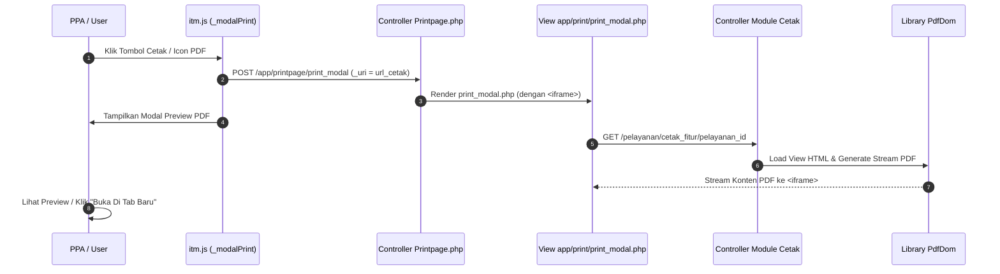

# Kaidah & Standar Pembuatan List Cetak & PDF SIMRS RSUD Soedomo

Dokumen ini menjelaskan standar arsitektur pencetakan dokumen medis, pratinjau (*preview*) PDF berbasis modal, Tanda Tangan Elektronik (TTE), dan pembuatan template cetak PDF di SIMRS RSUD Soedomo.

---

## 1. Arsitektur Pratinjau Modal Cetak (*Modal Print Engine*)

Di SIMRS RSUD Soedomo, pencetakan dokumen ERM/pelayanan **TIDAK LANGSUNG** mengunduh file atau membuka tab baru secara paksa. Sistem menggunakan jembatan modal preview (`Printpage::print_modal`) berbasis `<iframe>` di dalam Bootstrap Modal.



---

## 2. Peluncur JavaScript Modal Cetak

### 2.1 `_modalPrint(event, arg, idx = 1)`
Digunakan untuk membuka preview dokumen cetak standar (Non-TTE).

```html
<!-- Contoh Tombol Cetak di DataTables / Modal Level 1 -->
<a href="javascript:void(0)"
   onclick="_modalPrint(event, {uri: '<?= site_url($this->template . 'cetak_tih/' . $pelayanan_id . '/' . $tih_id) ?>', size: 'modal-xl', title: 'CETAK TRANSFER INTRA HOSPITAL'}, 2)"
   class="btn btn-info btn-xs">
  <i class="fas fa-print me-1"></i> Cetak
</a>
```

### 2.2 `_modalPrintTTE(event, arg, idx = 1)`
Digunakan untuk membuka preview dokumen cetak yang mendukung verifikasi dan Tanda Tangan Elektronik (TTE).

```html
<a href="javascript:void(0)"
   onclick="_modalPrintTTE(event, {uri: '<?= site_url($this->template . 'cetak_tih_tte/' . $pelayanan_id . '/' . $tih_id) ?>', size: 'modal-xl', title: 'CETAK & VERIFIKASI TTE'}, 2)"
   class="btn btn-warning btn-xs">
  <i class="fas fa-file-signature me-1"></i> Cetak TTE
</a>
```

---

## 3. Komponen Bridge & Template View Preview (`print_modal.php`)

Controller [Printpage.php](file:///home/geri/ITM/SOEDOMO/simrs/application/modules/app/controllers/Printpage.php) menerima URL `_uri` dari AJAX POST dan merender view `app/print/print_modal.php`:

```html
<!-- Konten Views app/print/print_modal.php -->
<style>
  #frame_pdf {
    width: 100%;
    min-height: 80vh;
  }
</style>

<div class="card-body">
  <div class="row">
    <div class="col-md-12">
      <iframe id="frame_pdf" src="<?= $uri ?>" frameborder="0"></iframe>
    </div>
  </div>
  <div class="border-dotted"></div>
  <div class="mt-2 text-center">
    <button type="button" class="btn btn-secondary" data-bs-dismiss="modal">
      <?= _icon('cancel') ?> Tutup
    </button>
    <a href="<?= $uri ?>" target="_blank" class="btn btn-primary">
      Buka Di Tab Baru <i class="fas fa-external-link-alt ms-1"></i>
    </a>
  </div>
</div>
```

---

## 4. Kaidah Penulisan Controller Cetak (`Pelayanan.php`)

Setiap method pencetakan pada controller wajib mengikuti 5 aturan berikut:

1. **ALOKASI MEMORI WAJIB**: Sertakan `ini_set("memory_limit", "-1");` di awal method untuk mencegah error *fatal out of memory* saat me-render HTML/gambar berukuran besar.
2. **NAMA FILE PDF STRUKTUR**: Tentukan `$file_pdf = 'cetak_' . $nama_fitur . '_' . $pelayanan_id`.
3. **PENGAMBILAN IDENTITAS RS**: Wajib mengambil identitas resmi RSUD Soedomo via `$data['identitas'] = $this->m_app->identitas_get();` untuk Kop Surat.
4. **SETTING KERTAS & ORIENTASI**: Definisikan `$paper = 'A4'` (atau `'F4'`) dan `$orientation = 'portrait'` (atau `'landscape'`).
5. **DOMPDF GENERATE**: Panggil `$this->pdfdom->generate($html, $file_pdf, $paper, $orientation)`.

```php
public function cetak_tih($pelayanan_id = null, $tih_id = null)
{
    // 1. Alokasi Memori Murni
    ini_set("memory_limit", "-1");

    // 2. Metadata File & Kertas
    $file_pdf    = 'cetak_tih_' . $pelayanan_id;
    $paper       = 'A4';
    $orientation = 'portrait';

    // 3. Query Data Substantif
    $data['identitas'] = $this->m_app->identitas_get();
    $data['pelayanan'] = $this->m_pelayanan->get_pelayanan($pelayanan_id);
    $data['pasien']    = $this->m_pelayanan->get_detail_pasien(@$data['pelayanan']['pasien_id']);
    $data['main']      = $this->m_pelayanan->get_tih($tih_id);

    // 4. Render HTML View ke String
    $html = $this->load->view($this->template . 'cetak/cetak_tih', $data, true);

    // 5. Generate PDF Stream
    $this->load->library('PdfDom');
    $this->pdfdom->generate($html, $file_pdf, $paper, $orientation);
}
```

---

## 5. Kaidah Penulisan Template HTML View Cetak (`cetak_tih.php`)

Template cetak PDF di-render menggunakan library **Dompdf** (`PdfDom.php`). Untuk memastikan tampilan rapi dan terhindar dari bug layout Dompdf, ikuti panduan berikut:

### 5.1 Rules CSS untuk Dompdf:
- **Gunakan Inlined & Internal CSS Style Tag**: Dompdf membutuhkan CSS murni tanpa ketergantungan JavaScript/Flexbox modern.
- **Gunakan Layout Berbasis Table HTML**: Hindari CSS Flexbox (`display: flex`) atau Grid; gunakan `<table>` standar HTML dengan `width="100%"`.
- **Pengatur Pemutusan Halaman**: Gunakan CSS `page-break-after: always;` atau `page-break-inside: avoid;` untuk tabel yang berlanjut ke halaman berikutnya.

### 5.2 Template HTML Standardized Header Kop Surat & Konten

```html
<!DOCTYPE html>
<html>
<head>
  <meta charset="utf-8">
  <title>FORMULIR TRANSFER INTRA HOSPITAL</title>
  <style>
    body { font-family: sans-serif; font-size: 11px; color: #000; line-height: 1.3; }
    table { width: 100%; border-collapse: collapse; margin-bottom: 8px; }
    .table-bordered th, .table-bordered td { border: 1px solid #000; padding: 4px; }
    .text-center { text-align: center; }
    .text-right { text-align: right; }
    .fw-bold { font-weight: bold; }
    .header-title { font-size: 14px; font-weight: bold; text-decoration: underline; }
  </style>
</head>
<body>

  <!-- KOP SURAT IDENTITAS RSUD SOEDOMO -->
  <table>
    <tr>
      <td width="15%" class="text-center">
        " width="60px">
      </td>
      <td width="55%">
        <span style="font-size: 14px; font-weight: bold;"><?= strtoupper(@$identitas['nama_instansi']) ?></span><br>
        <span style="font-size: 10px;"><?= @$identitas['alamat_instansi'] ?> - Telp. <?= @$identitas['telepon_instansi'] ?></span><br>
        <span style="font-size: 10px;">Email: <?= @$identitas['email_instansi'] ?></span>
      </td>
      <td width="30%" class="table-bordered">
        <strong>NO. RM: <?= @$pasien['pasien_id'] ?></strong><br>
        Nama: <?= @$pasien['pasien_nm'] ?><br>
        Tgl. Lahir / JK: <?= to_date(@$pasien['tgl_lahir']) ?> / <?= @$pasien['jenis_kelamin'] ?>
      </td>
    </tr>
  </table>

  <hr style="border: 1px solid #000; margin-bottom: 12px;">

  <div class="text-center header-title">FORMULIR TRANSFER INTRA HOSPITAL (TIH)</div>
  <br>

  <!-- DATA SUBSTANTIF DOKUMEN -->
  <table class="table-bordered">
    <tr>
      <td width="25%" class="fw-bold">Tanggal Transfer</td>
      <td width="75%"><?= to_date(@$main['tgl_transfer'], '', 'full_date') ?></td>
    </tr>
    <tr>
      <td class="fw-bold">Ruang Asal $\rightarrow$ Tujuan</td>
      <td><?= @$main['lokasi_asal_nm'] ?> $\rightarrow$ <?= @$main['lokasi_tujuan_nm'] ?></td>
    </tr>
    <tr>
      <td class="fw-bold">Catatan PPA</td>
      <td><?= nl2br(@$main['catatan_transfer']) ?></td>
    </tr>
  </table>

  <!-- TANDA TANGAN / VERIFIKASI PPA -->
  <table style="margin-top: 30px;">
    <tr>
      <td width="50%" class="text-center">
        Petugas Yang Menyerahkan,<br><br><br><br>
        ( <u><?= _ses_get('user_realname') ?></u> )
      </td>
      <td width="50%" class="text-center">
        Dokter Penanggung Jawab (DPJP),<br><br><br><br>
        ( <u><?= @$main['dokter_nm'] ?></u> )
      </td>
    </tr>
  </table>

</body>
</html>
```
