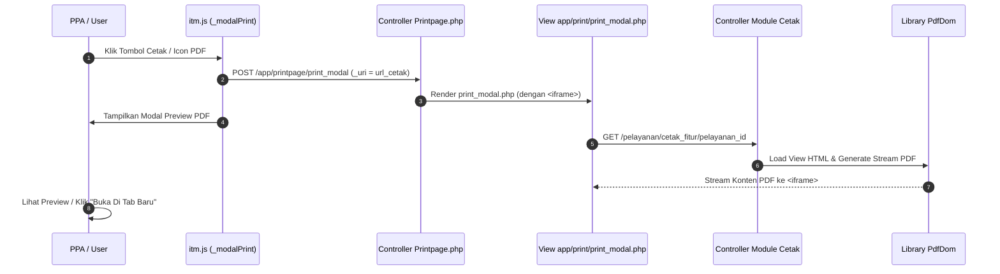

# Kaidah & Standar Pembuatan List Cetak & PDF SIMRS RSUD Soedomo

Dokumen ini menjelaskan standar arsitektur pencetakan dokumen medis, pratinjau (*preview*) PDF berbasis modal, Tanda Tangan Elektronik (TTE), dan pembuatan template cetak PDF di SIMRS RSUD Soedomo.

> [!CAUTION]
> **STANDAR TUNGGAL BENCHMARK LEMBAR CETAK (NON-NEGOTIABLE RULE)**:
> Seluruh pembuatan cetakan PDF ERM **WAJIB KONSISTEN 100%** mengikuti acuan paten **Pengkajian Geriatri Rawat Jalan** (`cetak_pengkajian_geriatri_rajal.php`).
> 
> **ATURAN SUCI KOP SURAT 3-KOLOM (MURNI & SIMETRIS)**:
> 1. Kop Surat 3-Kolom Official (Logo RS + Identitas, Box Pasien, Box Registrasi) **TIDAK BOLEH DICAMPUR ATAU DIBERI KOMPONEN LAIN** (seperti Form Kode kustom di dalam box, digit box, dll.). Kop Surat harus murni dan bersih!
> 2. **KONSISTENSI SIMETRIS HEIGHT BOX PROFIL & METADATA (FIXED HEIGHT 105px)**:
>    Box Profil Pasien (Kolom 2) dan Box Metadata Registrasi (Kolom 3) **WAJIB SAMA TINGGI & SIMETRIS 100%**.
>    Gunakan `height: 105px;` pada kedua elemen `<div>` pembungkus box agar garis border bawah kedua box sejajar horizontal sempurna:
>    ```html
>    <div style="border: 1px solid #000; padding: 4px; height: 105px;">
>    ```
> 3. **Kolom 1 (`36%` width)**: Logo Base64 RSUD Soedomo via `$identitas['lap_logo']` + Identitas Resmi RS.
> 4. **Kolom 2 (`32%` width)**: Box Profil Pasien (`border: 1px solid #000; padding: 4px; height: 105px;`) berisi Nama, Jenis Kelamin, Tgl Lahir, Umur, Alamat.
> 5. **Kolom 3 (`32%` width)**: Box Metadata Registrasi (`border: 1px solid #000; padding: 4px; height: 105px;`) HANYA berisi 6 field standar:
>    - `No Registrasi`
>    - `No RM`
>    - `Ruangan`
>    - `Kelas`
>    - `Tgl. MRS`
>    - `Tgl. KRS`
> 6. Judul Dokumen (`.header-title`) ditempatkan langsung di bawah Kop Surat 3-Kolom.
> 7. Metadata atau digit box khusus formulir (seperti Bulan/Tahun, Kode RS, No Urut Kematian) diletakkan di bawah Judul Dokumen sebagai bagian dari konten body, bukan di dalam Kop Surat.
> 8. Seluruh isi dokumen per halaman WAJIB dibungkus `<div class="page-wrapper">` dengan border hitam solid `1.5px solid #000`.
> 9. Menggunakan font `DejaVu Sans` untuk simbol centang `&#9745;` (tercentang) dan `&#9744;` (kosong).

---

## 1. Arsitektur Pratinjau Modal Cetak (*Modal Print Engine*)

SIMRS RSUD Soedomo menggunakan jembatan modal preview (`Printpage::print_modal`) berbasis `<iframe>` di dalam Bootstrap Modal.



---

## 2. Peluncur JavaScript Modal Cetak

### 2.1 `_modalPrint(event, arg, idx = 1)`
Digunakan untuk membuka preview dokumen cetak standar (Non-TTE).

```html
<!-- Tombol Cetak Standard pada DataTables / Modal Level 1 -->
<a href="javascript:void(0)"
   onclick="_modalPrint(event, {uri: '<?= site_url($this->template . 'cetak_modul/' . $pelayanan_id . '/' . $modul_id) ?>', size: 'modal-xl', title: 'Cetak Dokumen'}, 5)"
   class="btn btn-sm btn-primary">
  <i class="fas fa-print me-1"></i> Cetak
</a>
```

### 2.2 `_modalPrintTTE(event, arg, idx = 1)`
Digunakan untuk membuka preview dokumen cetak yang mendukung verifikasi dan Tanda Tangan Elektronik (TTE).

```html
<a href="javascript:void(0)"
   onclick="_modalPrintTTE(event, {uri: '<?= site_url($this->template . 'cetak_modul_tte/' . $pelayanan_id . '/' . $modul_id) ?>', size: 'modal-xl', title: 'Cetak & Verifikasi TTE'}, 5)"
   class="btn btn-sm btn-primary">
  <i class="fas fa-file-signature me-1"></i> Cetak TTE
</a>
```

---

## 3. Kaidah Penulisan Controller Cetak (`Pelayanan.php`)

Setiap method pencetakan pada controller wajib mengikuti aturan berikut:

1. **ALOKASI MEMORI WAJIB**: Sertakan `ini_set("memory_limit", "-1");` di awal method.
2. **NAMA FILE PDF STRUKTUR**: Tentukan `$file_pdf = 'cetak_' . $nama_fitur . '_' . $pelayanan_id`.
3. **PENGAMBILAN IDENTITAS RS**: Wajib mengambil identitas resmi RSUD Soedomo via `$data['identitas'] = $this->m_app->identitas_get();` untuk Kop Surat.
4. **SETTING KERTAS & ORIENTASI**: Definisikan `$paper = 'f4'` (atau `'a4'`) dan `$orientation = 'portrait'`.
5. **DOMPDF GENERATE**: Panggil `$this->pdfdom->generate($html, $file_pdf, $paper, $orientation)`.

```php
public function cetak_modul($pelayanan_id = null, $modul_id = null)
{
    ini_set("memory_limit", "-1");

    $file_pdf    = 'Cetak_modul_' . $pelayanan_id;
    $paper       = 'f4';
    $orientation = 'portrait';

    $data['identitas'] = $this->m_app->identitas_get();
    $data['pelayanan'] = $this->m_pelayanan->get_pelayanan($pelayanan_id);
    $data['pasien']    = $this->m_pelayanan->get_detail_pasien(@$data['pelayanan']['pasien_id']);
    $data['main']      = $this->m_pelayanan->get_modul($modul_id);

    $html = $this->load->view($this->template . 'cetak/cetak_modul', $data, true);

    $this->load->library('PdfDom');
    $this->pdfdom->generate($html, $file_pdf, $paper, $orientation);
}
```

---

## 4. Template Paten View Cetak ERM (`cetak_pengkajian_geriatri_rajal.php`)

```html
<!DOCTYPE html>
<html>
<head>
  <meta charset="utf-8">
  <title>PENGKAJIAN GERIATRI RAWAT JALAN - RM 13.8.1</title>
  <style>
    @page { margin: 10px 15px 10px 15px; }
    body { font-family: Arial, Helvetica, sans-serif; font-size: 9.5px; color: #000; line-height: 1.2; }
    .page-wrapper { border: 1.5px solid #000; padding: 6px; position: relative; }
    table { width: 100%; border-collapse: collapse; margin-bottom: 4px; }
    .table-bordered th, .table-bordered td { border: 1px solid #000; padding: 3px 4px; }
    .text-center { text-align: center; }
    .text-right { text-align: right; }
    .fw-bold { font-weight: bold; }
    .header-title { font-size: 12px; font-weight: bold; text-align: center; margin-top: 4px; margin-bottom: 6px; text-decoration: underline; }
    .footer-page { position: absolute; bottom: 8px; right: 12px; font-size: 8.5px; }
    .check-mark { font-family: DejaVu Sans, sans-serif; font-weight: bold; }
  </style>
</head>
<body>

  <div class="page-wrapper">
    
    <!-- Kop Surat Standard SIMRS RSUD Soedomo (3 Kolom Official Murni & Simetris) -->
    <table style="width: 100%; border-collapse: collapse; margin-bottom: 6px;">
      <tr>
        <!-- Kolom 1: Logo & Identitas RSUD Soedomo -->
        <td width="36%" class="text-center" style="vertical-align: top; padding-right: 4px;">
          " height="45px" style="margin-bottom: 2px;"><br>
          <span style="font-size: 7.5px; font-weight: bold; display: block; line-height: 1.1;"><?= strtoupper(@$identitas['lap_title_1'] ? $identitas['lap_title_1'] : 'PEMERINTAH KABUPATEN ' . @$identitas['lap_ttd_daerah']) ?></span>
          <?php if (!empty($identitas['lap_title_2'])) : ?>
            <span style="font-size: 7px; font-weight: bold; display: block; line-height: 1.1;"><?= strtoupper(@$identitas['lap_title_2']) ?></span>
          <?php endif; ?>
          <span style="font-size: 11px; font-weight: bold; display: block; line-height: 1.2;"><?= strtoupper(@$identitas['rumahsakit_nm'] ? $identitas['rumahsakit_nm'] : @$identitas['nama_instansi']) ?></span>
          <span style="font-size: 7px; display: block; line-height: 1.1;"><?= @$identitas['lap_alamat'] ?><?= @$identitas['lap_telp_no'] ? ', Telp./Fax ' . @$identitas['lap_telp_no'] : '' ?></span>
          <span style="font-size: 7px; display: block; line-height: 1.1;">Email : <?= @$identitas['lap_email'] ? $identitas['lap_email'] : @$identitas['email'] ?></span>
          <span style="font-size: 7.5px; font-weight: bold; display: block; line-height: 1.1;"><?= strtoupper(@$identitas['lap_ttd_daerah']) ?></span>
        </td>

        <!-- Kolom 2: Box Profil Pasien (Fixed Height 105px Simetris) -->
        <td width="32%" style="vertical-align: top; padding-right: 4px;">
          <div style="border: 1px solid #000; padding: 4px; height: 105px;">
            <table style="width: 100%; font-size: 8.5px; border-collapse: collapse; line-height: 1.25;">
              <tr>
                <td width="36%" style="vertical-align: top;"><strong>Nama</strong></td>
                <td width="5%" style="vertical-align: top;">:</td>
                <td style="vertical-align: top;"><strong><?= strtoupper(@$pasien['pasien_nm'] ? $pasien['pasien_nm'] : @$pelayanan['pasien_nm']) ?></strong></td>
              </tr>
              <tr>
                <td style="vertical-align: top;"><strong>Jenis Kelamin</strong></td>
                <td style="vertical-align: top;">:</td>
                <td style="vertical-align: top;"><?= strtoupper(@$pasien['jenis_kelamin'] ? $pasien['jenis_kelamin'] : (@$pasien['sex_id'] == '01' ? 'LAKI-LAKI' : 'PEREMPUAN')) ?></td>
              </tr>
              <tr>
                <td style="vertical-align: top;"><strong>Tgl Lahir</strong></td>
                <td style="vertical-align: top;">:</td>
                <td style="vertical-align: top;"><?= to_date(@$pasien['tgl_lahir'] ? @$pasien['tgl_lahir'] : @$pasien['lahir_tgl']) ?></td>
              </tr>
              <tr>
                <td style="vertical-align: top;"><strong>Umur</strong></td>
                <td style="vertical-align: top;">:</td>
                <td style="vertical-align: top;"><?= (isset($pelayanan['umur_thn']) || isset($pelayanan['umur_bln']) || isset($pelayanan['umur_hari'])) ? @$pelayanan['umur_thn'] . 'thn ' . @$pelayanan['umur_bln'] . 'bln ' . @$pelayanan['umur_hari'] . 'hr' : @$pasien['umur'] ?></td>
              </tr>
              <tr>
                <td style="vertical-align: top;"><strong>Alamat</strong></td>
                <td style="vertical-align: top;">:</td>
                <td style="vertical-align: top;">
                  <?php
                    $rt_val = !empty($pasien['alamat_rt']) ? $pasien['alamat_rt'] : @$pelayanan['alamat_rt'];
                    $rw_val = !empty($pasien['alamat_rw']) ? $pasien['alamat_rw'] : @$pelayanan['alamat_rw'];
                    $kel_val = !empty($pasien['alamat_kelurahan_nm']) ? $pasien['alamat_kelurahan_nm'] : @$pelayanan['alamat_kelurahan_nm'];
                    $kec_val = !empty($pasien['alamat_kecamatan_nm']) ? $pasien['alamat_kecamatan_nm'] : @$pelayanan['alamat_kecamatan_nm'];
                    $kota_val = !empty($pasien['alamat_kota_nm']) ? $pasien['alamat_kota_nm'] : @$pelayanan['alamat_kota_nm'];
                    $prov_val = !empty($pasien['alamat_provinsi_nm']) ? $pasien['alamat_provinsi_nm'] : @$pelayanan['alamat_provinsi_nm'];

                    $arr_alamat = [];
                    if ($rt_val !== null || $rw_val !== null) {
                      $arr_alamat[] = 'RT ' . $rt_val . ' / RW ' . $rw_val;
                    }
                    if (!empty($kel_val)) $arr_alamat[] = $kel_val;
                    if (!empty($kec_val)) $arr_alamat[] = $kec_val;
                    if (!empty($kota_val)) $arr_alamat[] = $kota_val;
                    if (!empty($prov_val)) $arr_alamat[] = $prov_val;

                    $alamat_out = implode(', ', $arr_alamat);
                    echo !empty($alamat_out) ? strtoupper($alamat_out) : strtoupper(@$pasien['alamat_lengkap'] ? $pasien['alamat_lengkap'] : @$pasien['alamat']);
                  ?>
                </td>
              </tr>
            </table>
          </div>
        </td>

        <!-- Kolom 3: Box Metadata Registrasi (Fixed Height 105px Simetris) -->
        <td width="32%" style="vertical-align: top;">
          <div style="border: 1px solid #000; padding: 4px; height: 105px;">
            <table style="width: 100%; font-size: 8.5px; border-collapse: collapse; line-height: 1.25;">
              <tr>
                <td width="42%" style="vertical-align: top;"><strong>No Registrasi</strong></td>
                <td width="5%" style="vertical-align: top;">:</td>
                <td style="vertical-align: top;"><?= @$pelayanan['registrasi_id'] ?></td>
              </tr>
              <tr>
                <td style="vertical-align: top;"><strong>No RM</strong></td>
                <td style="vertical-align: top;">:</td>
                <td style="vertical-align: top;"><strong><?= @$pelayanan['rm_no'] ?></strong></td>
              </tr>
              <tr>
                <td style="vertical-align: top;"><strong>Ruangan</strong></td>
                <td style="vertical-align: top;">:</td>
                <td style="vertical-align: top;"><?= @$pelayanan['lokasi_nm'] ?></td>
              </tr>
              <tr>
                <td style="vertical-align: top;"><strong>Kelas</strong></td>
                <td style="vertical-align: top;">:</td>
                <td style="vertical-align: top;"><?= @$pelayanan['kelas_layanan_nm'] ? @$pelayanan['kelas_layanan_nm'] : (@$pelayanan['kelas_nm'] ? @$pelayanan['kelas_nm'] : '-') ?></td>
              </tr>
              <tr>
                <td style="vertical-align: top;"><strong>Tgl. MRS</strong></td>
                <td style="vertical-align: top;">:</td>
                <td style="vertical-align: top;"><?= to_date(@$pelayanan['registrasi_tgl'], '', 'full_date') ?></td>
              </tr>
              <tr>
                <td style="vertical-align: top;"><strong>Tgl. KRS</strong></td>
                <td style="vertical-align: top;">:</td>
                <td style="vertical-align: top;"><?= @$pelayanan['dilayani_selesai_tgl'] ? to_date(@$pelayanan['dilayani_selesai_tgl'], '', 'full_date') : '-' ?></td>
              </tr>
            </table>
          </div>
        </td>
      </tr>
    </table>

    <div class="header-title">JUDUL DOKUMEN CETAK ERM</div>

    <!-- KONTEN SUBSTANTIF DOKUMEN... -->

  </div>

</body>
</html>
