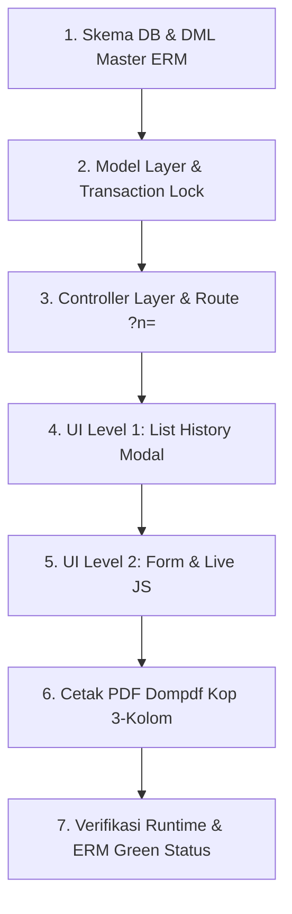

# PANDUAN PENGERJAAN ERM MULUS & PRESISI (RSUD SOEDOMO)

Dokumen ini berisi panduan alur kerja (workflow), arsitektur, dan *checklist* pembuatan modul **E-Rekam Medis (ERM)** baru di SIMRS RSUD Soedomo berdasarkan standar MCP terbaik yang terbukti berhasil dan berjalan mulus.

---

## 🏆 CONTOH ERM BENCHMARK TERBAIK (GOLD STANDARD)

Sebagai contoh referensi acuan mutlak implementasi ERM baru yang paling presisi, mulus, dan 100% patuh terhadap aturan MCP RSUD Soedomo, gunakan modul **PENGKAJIAN GERIATRI RAWAT JALAN (RM 13.8.1)**:

- **Berkas ERM**: `PENGKAJIAN GERIATRI RAWAT JALAN` (`RM 13.8.1`)
- **Master ERM ID**: `'06.0003'`
- **Tabel PostgreSQL**: `dat_pengkajian_geriatri_rajal` (Primary Key: `pengkajiangeriatrirajal_id`)
- **File DDL & DML**: [ddl_dat_pengkajian_geriatri_rajal.sql](file:///home/geri/ITM/SOEDOMO/simrs/database/ddl_dat_pengkajian_geriatri_rajal.sql)
- **File Model**: [M_pelayanan.php](file:///home/geri/ITM/SOEDOMO/simrs/application/modules/pelayanan/models/M_pelayanan.php#L27140-L27356)
- **File Controller**: [Pelayanan.php](file:///home/geri/ITM/SOEDOMO/simrs/application/modules/pelayanan/controllers/Pelayanan.php#L29680-L29775)
- **File List Modal Level 1**: [list_pengkajian_geriatri_rajal_modal.php](file:///home/geri/ITM/SOEDOMO/simrs/application/modules/pelayanan/views/pelayanan/list_pengkajian_geriatri_rajal_modal.php) & [_js_list_pengkajian_geriatri_rajal_modal.php](file:///home/geri/ITM/SOEDOMO/simrs/application/modules/pelayanan/views/pelayanan/_js_list_pengkajian_geriatri_rajal_modal.php)
- **File Form Modal Level 2**: [form_pengkajian_geriatri_rajal_modal.php](file:///home/geri/ITM/SOEDOMO/simrs/application/modules/pelayanan/views/pelayanan/asesmen/form_pengkajian_geriatri_rajal_modal.php) & [_js_form_pengkajian_geriatri_rajal_modal.php](file:///home/geri/ITM/SOEDOMO/simrs/application/modules/pelayanan/views/pelayanan/asesmen/_js_form_pengkajian_geriatri_rajal_modal.php)
- **File Cetak PDF Dompdf**: [cetak_pengkajian_geriatri_rajal.php](file:///home/geri/ITM/SOEDOMO/simrs/application/modules/pelayanan/views/pelayanan/cetak/cetak_pengkajian_geriatri_rajal.php)

---

## 🚀 7 Langkah Utama Pembangunan ERM Mulus



---

### 1. Tahap 1: Isolasi Database, Primary Key & Pendaftaran Master ERM
- **Nama Tabel Baru**: Wajib menggunakan prefix `dat_` dan nama deskriptif unik (misal: `dat_pengkajian_geriatri_rajal`).
- **Aturan Primary Key**: Wajib bernama `[namatabel_tanpa_prefix]_id` VARCHAR(50) (misal: `pengkajiangeriatrirajal_id`).
- **8 Kolom Audit Log Mandatory**:
  ```sql
  created_at TIMESTAMP WITHOUT TIME ZONE DEFAULT NOW(),
  created_by VARCHAR(50),
  updated_at TIMESTAMP WITHOUT TIME ZONE,
  updated_by VARCHAR(50),
  deleted_at TIMESTAMP WITHOUT TIME ZONE,
  deleted_by VARCHAR(50),
  active_st SMALLINT DEFAULT 1,
  deleted_st SMALLINT DEFAULT 0
  ```
- **DML Registration**: Daftarkan pada `mst_erekam_medis` dengan ID baru (misal `'06.0003'`), `berkas_no` (misal `'RM 13.8.1'`), nama berkas, dan peluncur `list_[fitur]_modal/pelayanan_id/registrasi_id`.

---

### 2. Tahap 2: Model Layer (`M_pelayanan.php`)
- **Query DataTables Server-Side**: Wajib dibungkus subquery alias `'a'`:
  ```php
  public function load_datatables_pengkajian_geriatri_rajal($pelayanan_id) {
    $sql = "SELECT * FROM (
              SELECT a.*, p.pegawai_nm AS perawat_nm, d.pegawai_nm AS dokter_nm
              FROM dat_pengkajian_geriatri_rajal a
              LEFT JOIN mst_pegawai p ON a.perawat_id = p.pegawai_id
              LEFT JOIN mst_pegawai d ON a.dokter_id = d.pegawai_id
              WHERE a.pelayanan_id = '$pelayanan_id' AND a.deleted_st = 0
            ) a";
    return $this->db_load_datatables($sql);
  }
  ```
- **Auto-Fill Data Terdahulu**: Sediakan method pencarian data asesmen terdahulu (misal `get_previous_mmse_geriatri()`) untuk auto-fill field MMSE/asesmen lama.
- **Transaksi Lock & Generator ID**: Gunakan `DB::get_id('dat_[fitur]')` -> `DB::insert()` -> `DB::update_id()`.
- **Indikator Menu ERM Hijau**: Wajib mengeksekusi `log_erm('06.0003', $pelayanan_id, $registrasi_id, $lokasi_id, $pasien_id)` saat simpan sukses.

---

### 3. Tahap 3: Controller Layer (`Pelayanan.php`)
- **Parameter Navigation `?n=`**: Sertakan `?n=<?= _get('n') ?>` pada seluruh action URL form, DataTables, dan link cetak PDF agar tidak redirect ke dashboard.
- **Auto-Populate Data Klinis**:
  1. **Diagnosis Medis**: Ambil dari `dat_anamnesis.icd10_dokter` (JSON decode `diagnosis_klinis` & `icd10_nm`).
  2. **Dokter DPJP**: Ambil default dari `dat_registrasi` (`r.dpjp_id` + `mst_pegawai`).
- **Memory Limit PDF**: Selalu tambahkan `ini_set("memory_limit", "-1")` pada fungsi `cetak_[fitur]()`.

---

### 4. Tahap 4: UI Level 1 - List History Modal
- Tempatkan file pada `views/pelayanan/list_[fitur]_modal.php` dan `_js_list_[fitur]_modal.php`.
- Menggunakan Modal Stack Level 1 (`#my-modal-1`).
- Rendertable DataTables menampilkan ringkasan skor/kategori penting serta tombol aksi Edit, Hapus, dan Cetak PDF.

---

### 5. Tahap 5: UI Level 2 - Form Input & Real-Time Calculation
- Tempatkan file pada `views/pelayanan/asesmen/form_[fitur]_modal.php` dan `_js_form_[fitur]_modal.php`.
- Menggunakan Modal Stack Level 2 (`#my-modal-2`).
- **Real-Time JS Triggers**:
  - Pasang atribut `onchange="hitungSkor()"` dan `onclick="hitungSkor()"` langsung pada input radio/select.
  - Tambahkan multi-event delegation pada JS: `$(document).on('click change input', 'selector', function() { ... })`.
- **Script Placement**: File JS `_js_form_[fitur]_modal.php` diletakkan di **paling bawah** file view (setelah `</form>`).

---

### 6. Tahap 6: Cetak PDF Dompdf Standard RSUD Soedomo
- Tempatkan file pada `views/pelayanan/cetak/cetak_[fitur].php`.
- **Kop Surat 3-Kolom Official Murni & Simetris (`height: 105px;`)**:
  - Kolom 1 (`36%`): Logo Base64 RSUD Soedomo + Identitas Instansi.
  - Kolom 2 (`32%`): Box Profil Pasien (`height: 105px;`).
  - Kolom 3 (`32%`): Box Metadata Registrasi (`height: 105px;`) 6 baris standard.
- **Standardisasi Mutlak `berkas_no`**: Wajib menggunakan 3-Tier Fallback Retrieval di Controller dan ekspresi dinamis `(<?= !empty($berkas_no) ? $berkas_no : 'RM XX.X' ?>)` pada `.header-title` lembar cetak PDF. Dilarang meng-hardcode string RM statis.
- **DejaVu Sans for Checkmarks**: Gunakan entitas HTML `&#9745;` (checked) & `&#9744;` (unchecked) dengan `font-family: DejaVu Sans, sans-serif`.
- **Side-by-side Signatures**: Tanda tangan Perawat & Dokter DPJP menggunakan helper `format_ttd_src()`.

---

### 7. Tahap 7: Verifikasi & Checklist Sukses
- [x] Tidak ada syntax error / linter warning.
- [x] Tidak ada response AJAX NULL.
- [x] Indikator berkas ERM berubah menjadi hijau tebal di menu navigasi SIMRS.
- [x] Fungsi cetak PDF berjalan lancar tanpa `Memory Limit Exceeded`.
